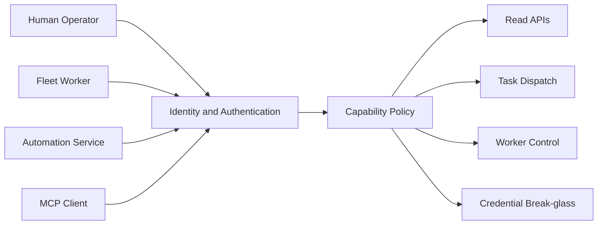
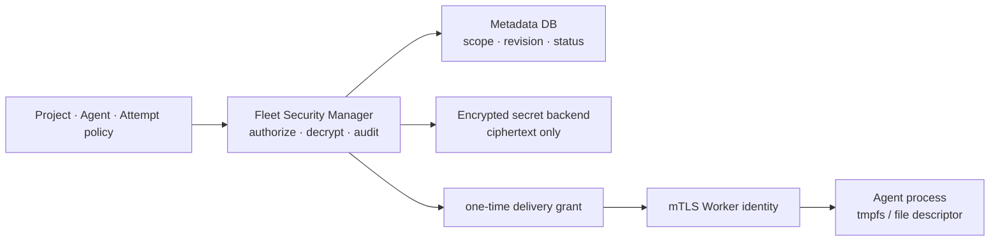

# Control Plane 신원·권한·시크릿 모델

> **정본 범위:** 이 문서는 목표 보안 계약을 정의한다. 현재 구현은 이 계약을 완전히
> 만족하지 않으며, 아래 상태 표와 [security findings](reports/security-findings.md)를 함께 확인해야 한다.

## 현재 구현과 목표의 차이

| 주제 | 현재 구현 | 목표 계약 |
|---|---|---|
| API 인증 | non-loopback bind는 scoped bearer manifest 또는 Cloudflare audience 없이 기동을 거부. bearer는 principal·capability를 가진 JSON manifest이고 등록된 관리 route는 capability를 검사. Cloudflare claim→principal 연결과 Worker self binding은 배선 완료 | Project scope와 audit 확장은 #58 잔여 |
| capability 행렬 커버리지 | `authorize_http_endpoint`가 행렬 미등록 route를 기본 deny로 처리한다(`#73` 완료). `/health`·`POST /workers/join`만 명시 예외. Dashboard `/api`에는 아직 같은 불변식이 없음(`#92`) | Dashboard 표면 적용 |
| Cloudflare 전용 배포의 권한 | **principal→capability 매핑이 없으면 인증 통과 주체가 전체 capability를 받는다.** 매핑을 설정하는 경로가 `fleet-cli`에 없어 운영 배포에서 끌 수 없다 | 매핑 없는 principal에게 write·export capability를 부여하지 않으며, 매핑 부재 시 기동을 거부 |
| admin bearer 회전 | `admin_api_tokens` digest 저장, create/rotate/revoke/list API, `FLEET_API_TOKENS` env→DB 1회 자동 전환 (#72 완료) | 제3자 발급 시크릿(`FLEET_GMAIL_APP_PASS` 등)은 이 메커니즘 대상 아님 |
| 최초 admin 토큰 발급 | `fleet serve`가 `--http-bind` 기동 시 `admin_api_tokens`가 비어 있으면(env sync 이후에도) 전체 capability 토큰 1개를 발급해 `0600` 파일로 1회 출력한다(`#80` 완료). env로 admin을 구성한 배포에는 추가 발급하지 않음 | 없음 — 완료 |
| bootstrap token 저장 | Fleet DB·메모리 저장소는 SHA-256 digest만 보관하며 PostgreSQL migration이 기존 값을 치환. Worker 설정에는 join 전 일회성 원문이 있을 수 있음 | digest·식별자만 저장하고 발급 응답에서만 원문 표시. join 뒤 Worker 설정 원문 제거와 Worker identity 전환은 #60 |
| Worker identity | join이 digest-only `fwo_` operational credential을 1회 발급하고 register/heartbeat/deregister가 `worker:self` binding을 검사. rotate/revoke API 존재. `agent_endpoint`의 `server-key`는 여전히 평문 전파 | mTLS identity(#60 9단계)와 secret을 URL 밖으로 분리 |
| MCP 권한 | `FLEET_MCP_CAPABILITIES` launcher allow-list로 노출 도구를 제한하고 값이 없으면 stdio 기동을 거부. ToolContext에는 아직 principal·project scope가 없음 | principal·capability·project scope를 fail-closed로 검사 |
| credential authority | LLM credential의 read/export/manage capability가 분리되고 export는 감사 기록 실패 시 거절(#66). 원문 export API 자체는 존속 | Fleet Security Manager만 복호화·grant 발급; Orchestrator는 원문 미취급 |
| 감사 범위 | `AuditEvent`를 남기는 경로는 LLM credential put/export/delete 3곳뿐. 나머지 mutation과 모든 capability 거절은 `tracing`만 | 모든 mutation·거절·grant·break-glass를 상관관계 필드와 함께 append-only 기록 |

현재 enrollment 동작과 완료 조건은 [Worker enrollment 계약](../contracts/worker-enrollment.md)을
따른다. 이 표의 목표를 현재 운영 절차로 해석하지 않는다.

## 원칙

유효한 bearer 하나가 전체 control plane 권한을 갖는 평면 권한 모델을 폐기한다.
HTTP와 MCP 모두 인증된 principal과 capability set을 요청 컨텍스트에 포함하고 같은
authorization policy를 사용한다.

## Principal 유형

Principal 분류, capability 카탈로그, Project scope, break-glass 및 append-only audit의 상세
계약은 [Authorization·Project Scope·감사](authorization-and-audit.md)가 정본이다. 이 문서는
분류표를 중복 보유하지 않는다.

이 문서가 소유하는 불변식은 하나다: Worker identity는 join 시 발급한 scoped credential 또는
mTLS certificate를 `worker_id`와 암호학적으로 결합하며, 공용 admin bearer를 Worker 운영
credential로 재사용하지 않는다.

## Agent 실행 격리

Agent의 실행 격리는 인증·권한 정책의 일부다. 신뢰된 단일 프로젝트만 `host_trusted`를
쓸 수 있고, 다중 프로젝트 또는 신뢰되지 않은 외부 입력은 `container_required`다.
권한 있는 caller라도 더 약한 격리를 요청하거나 Worker가 임의로 downgrade할 수 없다.
격리 결정, 정책 version, runtime/image digest 및 terminal attach grant는 attempt 감사
레코드에 남긴다. 상세는 [Agent 실행 격리](../architecture/agents/execution-isolation.md)를 따른다.

Fleet privileged operation은 Agent의 일반 sudo 권한이 아니다. root-owned helper가 typed tool,
Project scope, Attempt fencing token, expiry를 다시 검증하고 effect ledger·감사를 남길 때만 수행한다.

## Bootstrap token

- DB에는 원문 대신 token id와 HMAC digest를 저장한다.
- 원문은 생성 응답에서 한 번만 보여준다.
- 목록은 id, prefix, last4, 생성자, 만료, 사용 여부만 반환한다.
- 폐기는 URL path의 원문이 아니라 immutable token id로 수행한다.
- proxy, tracing, audit, MCP transcript에 대한 redaction 테스트를 둔다.

## MCP 권한

MCP stdio라는 이유로 신뢰된 것으로 간주하지 않는다. 상세 계약(ToolContext의 principal·capability·
project scope 주입, 등록되지 않은 tool의 fail-closed)은
[Authorization·Project Scope·감사](authorization-and-audit.md)의 Transport 절이 정본이다.

## 시크릿 전달

Fleet 내부의 **Security Manager**가 credential 사용의 단일 authority다. Orchestrator는 Project,
Agent, TaskAttempt 정책을 Security Manager에 전달할 뿐 원문을 읽거나 export하지 않는다. 초기
encrypted backend는 Postgres일 수 있지만, 저장 backend는 Security Manager의 구현 세부사항이며
향후 KMS/HSM 또는 외부 secret backend로 교체 가능해야 한다.

- credential 원문은 Git, context, prompt, API/MCP 응답, 감사 로그에 저장·반환하지 않는다.
- Security Manager는 `credential_id`, revision, Project scope, Agent/Tool grant, Attempt·Worker
  binding을 모두 확인한 뒤에만 one-time·짧은 TTL delivery grant를 발급한다.
- Worker는 원문 대신 `attempt_id`와 grant만 제출한다. 전달은 `tmpfs` read-only mount 또는 제한된
  file descriptor를 기본으로 하고, 환경변수·URL query·CLI 인자는 금지한다.
- revoke는 새 grant를 즉시 막고 WarmIdle을 즉시 종료한다. Running Attempt는 credential 위험도에
  따라 grace 종료 또는 즉시 중단하며 결과를 `Revoked` 사유와 함께 감사한다.
- rotation은 새 revision 생성 → Project grant 전환 → 새 Attempt 적용 → grace 종료 → 이전 revision
  폐기 순서다. 외부 backend의 version 불일치·접근 거부는 fail-closed `Unavailable` 상태다.
- 원문 export는 일반 API가 아니다. 별도 break-glass capability, 재인증, 만료, 이중 감사가 있는
  운영 절차로만 허용한다.

## 운영 설정

프로덕션은 명시적 인증 설정이 없으면 기동을 거부한다. no-auth는 loopback bind와
명시적 development flag를 동시에 만족할 때만 허용한다.

## 검증 게이트

- Worker credential로 다른 worker_id를 변경할 수 없는 테스트
- 일반 Operator가 credential export와 bootstrap 원문 조회를 못 하는 테스트
- MCP prompt injection이 admin capability를 획득하지 못하는 테스트
- URL, log, trace, API 응답의 secret redaction 테스트
- credential 폐기 후 기존 연결과 세션이 정해진 시간 내 종료되는 테스트
- Security Manager가 다른 Project·Agent·Worker 조합의 delivery grant를 거절하는 테스트
- backend revision 불일치에서 이전 원문을 전달하지 않고 fail-closed하는 테스트
- Agent가 arbitrary sudo, host socket, 다른 workspace, 비허용 egress를 얻지 못하는 테스트
