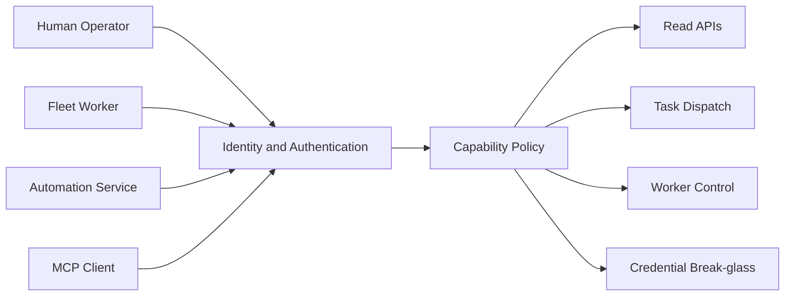

# Control Plane 신원·권한·시크릿 모델

> **정본 범위:** 이 문서는 목표 보안 계약을 정의한다. 현재 구현은 이 계약을 완전히
> 만족하지 않으며, 아래 상태 표와 [security findings](findings.md)를 함께 확인해야 한다.

## 현재 구현과 목표의 차이

| 주제 | 현재 구현 | 목표 계약 |
|---|---|---|
| API 인증 | API token 또는 Cloudflare audience가 없으면 no-auth로 시작 | production에서는 명시적 개발 모드 외 fail-closed |
| bootstrap token 저장 | DB와 Worker 설정에 원문이 남을 수 있음 | digest·식별자만 저장하고 발급 응답에서만 원문 표시 |
| Worker identity | 정적 API token과 bootstrap token 흐름이 분리되지 않음 | rotate/revoke 가능한 Worker-scoped credential 또는 mTLS identity |
| MCP 권한 | capability·project scope 정책이 완전 구현되지 않음 | principal·capability·project scope를 fail-closed로 검사 |

현재 enrollment 동작과 완료 조건은 [Worker enrollment 계약](../contracts/worker-enrollment.md)을
따른다. 이 표의 목표를 현재 운영 절차로 해석하지 않는다.

## 원칙

유효한 bearer 하나가 전체 control plane 권한을 갖는 평면 권한 모델을 폐기한다.
HTTP와 MCP 모두 인증된 principal과 capability set을 요청 컨텍스트에 포함하고 같은
authorization policy를 사용한다.

## Principal 유형

| Principal | 기본 권한 |
|---|---|
| Worker | 자기 등록 갱신, heartbeat, 자기 command/result |
| Operator | 조회, task submit/cancel, 승인된 운영 동작 |
| Service | 명시적으로 부여된 API와 project scope |
| SecurityAdmin | credential rotation/export, policy 관리 |

Worker identity는 join 시 발급한 scoped credential 또는 mTLS certificate를
`worker_id`와 암호학적으로 결합한다. 공용 admin bearer를 Worker 운영 credential로
재사용하지 않는다.

## Agent 실행 격리

Agent의 실행 격리는 인증·권한 정책의 일부다. 신뢰된 단일 프로젝트만 `host_trusted`를
쓸 수 있고, 다중 프로젝트 또는 신뢰되지 않은 외부 입력은 `container_required`다.
권한 있는 caller라도 더 약한 격리를 요청하거나 Worker가 임의로 downgrade할 수 없다.
격리 결정, 정책 version, runtime/image digest 및 terminal attach grant는 attempt 감사
레코드에 남긴다. 상세는 [Agent 실행 격리](../architecture/agents/execution-isolation.md)를 따른다.

## Bootstrap token

- DB에는 원문 대신 token id와 HMAC digest를 저장한다.
- 원문은 생성 응답에서 한 번만 보여준다.
- 목록은 id, prefix, last4, 생성자, 만료, 사용 여부만 반환한다.
- 폐기는 URL path의 원문이 아니라 immutable token id로 수행한다.
- proxy, tracing, audit, MCP transcript에 대한 redaction 테스트를 둔다.

## MCP 권한

MCP stdio라는 이유로 신뢰된 것으로 간주하지 않는다. ToolContext는 principal,
capabilities, project scope, request id를 가진다. destructive 또는 secret 관련 도구는
명시적 capability와 감사 이벤트가 없으면 fail-closed한다.

## 시크릿 전달

- URL query와 CLI 인자에 secret을 넣지 않는다.
- Authorization header, mTLS, file descriptor 또는 `0600` 파일을 사용한다.
- DB endpoint 문자열에는 credential을 포함하지 않는다.
- MCP server environment는 평문 JSON이 아니라 encrypted credential reference를 쓴다.
- credential export는 별도 break-glass capability, 재인증, 감사 로그를 요구한다.

## 운영 설정

프로덕션은 명시적 인증 설정이 없으면 기동을 거부한다. no-auth는 loopback bind와
명시적 development flag를 동시에 만족할 때만 허용한다.

## 검증 게이트

- Worker credential로 다른 worker_id를 변경할 수 없는 테스트
- 일반 Operator가 credential export와 bootstrap 원문 조회를 못 하는 테스트
- MCP prompt injection이 admin capability를 획득하지 못하는 테스트
- URL, log, trace, API 응답의 secret redaction 테스트
- credential 폐기 후 기존 연결과 세션이 정해진 시간 내 종료되는 테스트
