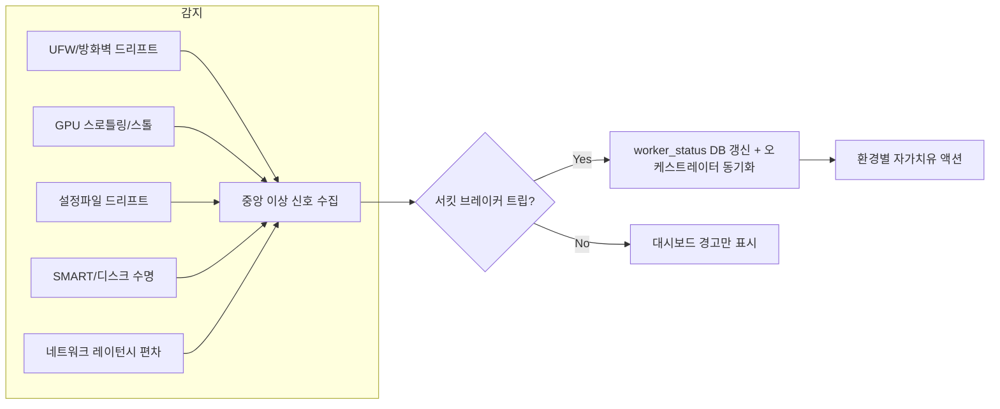

# 서버 관리 & 자가 치유 (Server Management & Self-Healing)

> 전체 문서 카탈로그는 [`../index.md`](../index.md). **이 도메인의 세 문서는 모두 로드맵
> 제안서이며 아직 구현되지 않았다** — 상태는 [`../roadmap/roadmap.md`](../roadmap/roadmap.md)와
> [`../roadmap/conflict-analysis.md`](../roadmap/conflict-analysis.md)에서 추적한다.

| 문서 | 다루는 범위 |
|---|---|
| [`advanced-management-proposals.md`](./advanced-management-proposals.md) | SSH 키 회수, UFW/Fail2ban, 설정 드리프트 감지, 네트워크 지연 진단, SMART 헬스체크 |
| [`linux-package-management.md`](./linux-package-management.md) | APT/DNF 래퍼, PackageKit D-Bus vs sudoers 권한 위임 |
| [`hardware-healing.md`](./hardware-healing.md) | GPU 스로틀/스톨 감지(NVML), 클라우드/베어메탈 차등 자가치유, 서킷브레이커 DB 공유(로드맵 #25) |
