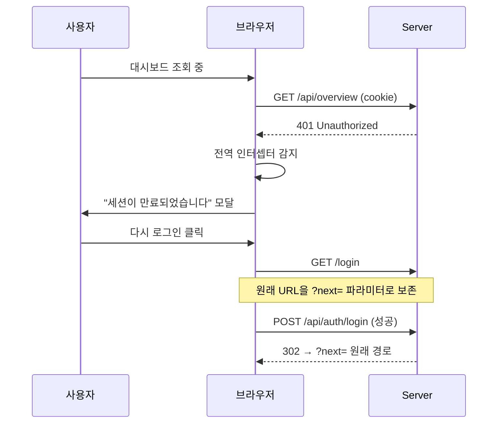
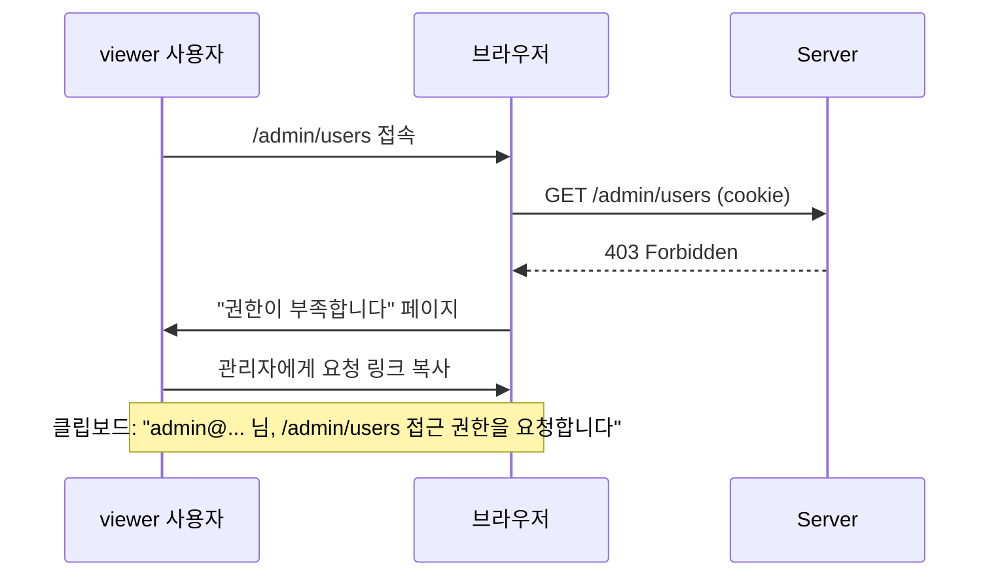

# UI/UX 화면 설계서

이 문서는 Grok Fleet Orchestrator 웹 대시보드의 화면 설계, 사용자 흐름,
내비게이션 패턴, 공통 컴포넌트를 정의합니다. 시스템 아키텍처는
[`architecture.md`](architecture.md), RBAC 구현 계획은 해당 plan 문서를
참조하세요.

## TL;DR

- **8개 페이지** 제안: 운영 코어 3 + 인증 2 + 관리 2 + 고급 1
- **이중 디자인 시스템**: 다크 테마(운영/관측) + Notion 테마(인증/관리)
- **3개 핵심 흐름**: 온보딩(Bootstrap → Login → Overview), 일반 운영
  (Login → Overview → Worker → Task), 관리자(User Mgmt → Audit Log)
- **공통 컴포넌트 11종**: StatusPill, Badge, Card, DataTable, EventLog,
  EmptyState, Avatar 등
- **구현 우선순위 3단계**: P0(MVP) → P1(운영 강화) → P2(확장)

---

## 1. 정보 아키텍처

```
fleet.agentthread.dev/
│
├── /                          # 메인 대시보드 (Overview)        [P0]
├── /login                     # 로그인                          [P0]
├── /bootstrap                 # 최초 관리자 설정                [P0]
│
├── /workers                   # 워커 목록 (Overview에 통합)
├── /workers/:id               # 워커 상세                       [P1]
│
├── /tasks                     # 태스크 큐                       [P1]
├── /tasks/:id                 # 태스크 상세 (큐에 통합)
│
├── /admin/users               # 사용자 관리                     [P1]
├── /admin/audit               # 감사 로그                       [P2]
│
└── /admin/tools               # MCP 도구 탐색기                 [P2]
```

### 라우트 가드 매트릭스

| 라우트           | 인증 | 최소 권한    | 비고                          |
| ---------------- | ---- | ------------ | ----------------------------- |
| `/login`         | ✗    | -            | 이미 로그인 시 `/`로 리다이렉트 |
| `/bootstrap`     | ✗    | -            | OTP 토큰 필요, 1회성          |
| `/`              | ✓    | viewer       | 기본 랜딩                    |
| `/workers/:id`   | ✓    | viewer       | 읽기 전용                     |
| `/tasks`         | ✓    | viewer       | 읽기 전용                     |
| `/admin/users`   | ✓    | administrator| 관리자 전용                   |
| `/admin/audit`   | ✓    | administrator| 관리자 전용                   |
| `/admin/tools`   | ✓    | operator     | 도구 호출은 operator 이상     |

---

## 2. 디자인 시스템

### 2.1 이중 테마 전략

| 테마         | 적용 페이지          | 철학                              |
| ------------ | -------------------- | --------------------------------- |
| **Dark**     | #1, #2, #3, #7       | 관측성, 모니터링, 데이터 밀도     |
| **Notion**   | #4, #5, #6, #8       | 인지 부담 최소, 신뢰, 온보딩 친화 |

사용자는 한 흐름 안에서 두 테마를 오가게 됩니다(예: Notion 로그인 →
Dark 대시보드). 전환 지점은 **라우트 경계**로 명확히 분리되므로 시각적
충돌이 없습니다.

### 2.2 색상 토큰

#### Dark 테마

```css
/* 배경/표면 */
--bg-app:        #0f1115;  /* 페이지 배경 (near-black) */
--bg-card:       #181b22;  /* 카드 표면 */
--bg-card-alt:   #1c1f27;  /* 강조 카드 */
--bg-inset:      #0d0f13;  /* 코드/터미널/인셋 */
--bg-hover:      #1f232c;  /* 행 호버 */

/* 테두리 */
--border-subtle: #232732;  /* 카드 외곽 */
--border-strong: #2a2e38;  /* 입력/강조 */
--border-table:  #1a1d24;  /* 테이블 헤더 구분 */

/* 텍스트 */
--text-primary:   #ffffff;
--text-secondary: #9ca3af;  /* 라벨/메타 */
--text-muted:     #6b7280;  /* 빈 상태/힌트 */
--text-faint:     #4b5563;  /* 타임스탬프 등 */

/* 상태 (sticker palette) */
--status-online:    #10b981;  /* green */
--status-degraded:  #f59e0b;  /* amber */
--status-offline:   #ef4444;  /* red */
--status-info:      #3b82f6;  /* blue */
--status-circuit:   #a855f7;  /* purple */
--status-neutral:   #6b7280;  /* gray */
```

#### Notion 테마

```css
/* 배경/표면 */
--canvas:         #f6f5f4;  /* warm canvas (페이지 배경) */
--canvas-soft:    #fafafa;  /* 헤더 행/서브 섹션 */
--surface:        #ffffff;  /* 카드 */
--surface-sunken: #f6f5f4;  /* 인셋/코드 블록 */

/* 테두리 */
--border-light:   #e9e9e9;  /* 카드/구분선 */
--border-input:   #d9d9d9;  /* 입력 필드 */

/* 텍스트 */
--text-heading:   #191919;
--text-body:      #37352f;  /* Notion 본문 톤 */
--text-muted:     #6b6b6b;
--text-faint:     #b3b3b3;

/* 액센트 (단일 주색 + 보조) */
--accent-primary: #0075de;  /* Notion Blue (CTA/링크) */
--accent-hero:    #213183;  /* deep indigo (Bootstrap hero) */

/* Sticker palette (장식 전용 — UI 강조에 사용 금지) */
--sticker-mustard: #d9730d;
--sticker-teal:    #0f7b6c;
--sticker-coral:   #e8855e;
--sticker-mint:    #4d6468;
--sticker-purple:  #9085d8;
```

### 2.3 타이포그래피

```css
/* 폰트 패밀리 */
--font-sans: "Inter", system-ui, -apple-system, sans-serif;
--font-mono: "JetBrains Mono", "SF Mono", Menlo, monospace;

/* 사이즈 스케일 */
--text-xs:    11px;   /* 타임스탬프, 카운터 */
--text-sm:    13px;   /* 라벨, 본문 small */
--text-base:  14px;   /* 기본 본문, 입력 */
--text-md:    15px;   /* 카드 제목 */
--text-lg:    18px;   /* 섹션 소제목 */
--text-xl:    20px;   /* 페이지 제목 small */
--text-2xl:   24px;   /* 페이지 제목 */
--text-3xl:   28px;   /* Notion 페이지 제목 */
--text-display: 48px; /* Bootstrap hero */

/* 자간 (Notion 핵심: 제목은 negative tracking) */
--tracking-tight:  -0.03em;  /* display */
--tracking-snug:   -0.01em;  /* 제목 */
--tracking-normal: 0;
--tracking-wide:   0.04em;   /* eyebrow, 라벨 */
--tracking-mono:   -0.01em;  /* 모노 본문 */

/* 행간 */
--leading-tight:   1.2;
--leading-normal:  1.5;
--leading-relaxed: 1.7;
```

### 2.4 라운드 스케일 (Notion 핵심 의도)

```css
--radius-xs:   4px;     /* 입력, 인풋 — tight */
--radius-sm:   6px;     /* 작은 카드, OTP 박스 */
--radius-md:   8px;     /* 일반 카드, 버튼 utility */
--radius-lg:   12px;    /* 큰 카드, 모달 */
--radius-xl:   16px;    /* 인증 카드 */
--radius-full: 9999px;  /* CTA primary (pill) */
```

> **Notion 미학의 핵심**: 입력은 `radius-xs(4px)`로 **tight** 하고,
> 주요 CTA 버튼은 `radius-full(9999px)`로 **pill** 형태입니다. 이
> **의도적 대비**가 Notion의 시그니처입니다.

### 2.5 그림자 / 그리드

```css
/* 그림자 (거의 없음 — Notion 철학) */
--shadow-0: none;
--shadow-1: 0 1px 2px rgba(0,0,0,0.04);            /* 카드 기본 */
--shadow-2: 0 4px 12px rgba(0,0,0,0.08);           /* 모달, 드롭다운 */
--shadow-glow: 0 0 0 3px rgba(0,117,222,0.20);     /* 포커스 링 */

/* 그리드 */
--space-1: 4px;
--space-2: 8px;
--space-3: 12px;
--space-4: 16px;
--space-5: 20px;
--space-6: 24px;
--space-8: 32px;
--space-10: 40px;
--space-12: 48px;
--space-16: 64px;

/* 레이아웃 */
--max-width-page:    1440px;
--max-width-auth:    400px;
--max-width-modal:   520px;
--content-padding:   48px;
```

---

## 3. 페이지별 상세 설계

### 3.1 페이지 #1 — 메인 대시보드 (Overview)

**라우트**: `/`  **권한**: viewer+  **테마**: Dark

**목적**: 시스템 전체 상태를 한 화면에. 운영자의 기본 랜딩.

#### 레이아웃

```
┌─────────────────────────────────────────────────────────────┐
│ HEADER: [logo] Fleet Orchestrator          [● online]      │
├─────────────────────────────────────────────────────────────┤
│ SECTION 1 — Overview (4 metric cards)                       │
│ ┌─────────┐ ┌─────────┐ ┌─────────┐ ┌─────────┐            │
│ │    1    │ │    0    │ │    0    │ │    0    │            │
│ │ Workers │ │ Active  │ │  Total  │ │ Circuit │            │
│ │ online  │ │  tasks  │ │  tasks  │ │  open   │            │
│ └─────────┘ └─────────┘ └─────────┘ └─────────┘            │
├─────────────────────────────────────────────────────────────┤
│ SECTION 2 — Workers                                         │
│ ┌─────────────────────────────────────────────────────────┐│
│ │ Worker ID │ Status │ Heartbeat │ Task │ Circuit         ││
│ │ arm2-prod │ ● on   │ 3s ago   │ idle │ closed          ││
│ └─────────────────────────────────────────────────────────┘│
├─────────────────────────────────────────────────────────────┤
│ SECTION 3 — Tasks                                           │
│ ┌─────────────────────────────────────────────────────────┐│
│ │ [empty state: No tasks yet — Dispatch via MCP]         ││
│ └─────────────────────────────────────────────────────────┘│
├─────────────────────────────────────────────────────────────┤
│ SECTION 4 — Events (SSE tail)                               │
│ ┌─────────────────────────────────────────────────────────┐│
│ │ [02:09:37] worker arm2 heartbeat received              ││
│ │ [02:09:22] worker arm2 joined (transport=acp)          ││
│ │ [02:08:51] scheduler tick: 0 pending, 0 dispatched     ││
│ │ [02:08:36] POST /v1/workers/register → 200 (12ms)      ││
│ └─────────────────────────────────────────────────────────┘│
└─────────────────────────────────────────────────────────────┘
```

#### 인터랙션

| 요소              | 동작                                            |
| ----------------- | ----------------------------------------------- |
| 카드 클릭         | 해당 섹션으로 스무스 스크롤                     |
| Worker 행 클릭    | `/workers/:id` 이동                             |
| Task 행 클릭     | `/tasks/:id` 이동 또는 인라인 확장              |
| Events 패널       | SSE 자동 갱신, 과거 100줄 버퍼, 자동 스크롤    |
| Status pill       | `/healthz` 폴링(15s)으로 online/offline 토글    |
| 데이터 갱신 주기  | overview 5s, workers 5s, tasks 10s, events 실시간 |

#### 빈 상태

- Tasks: "No tasks yet — Dispatch one via MCP tools" + 문서 링크
- Events: "Awaiting first event..." + 깜빡이는 커서
- Workers: "No workers registered. Start a worker with `fleet worker join`."

---

### 3.2 페이지 #2 — 워커 상세 (Worker Detail)

**라우트**: `/workers/:id`  **권한**: viewer+  **테마**: Dark

**목적**: 단일 워커의 건강도, 연결 상태, 작업 이력을 진단.

#### 레이아웃

```
┌─────────────────────────────────────────────────────────────┐
│ ← Workers / arm2-prod                       [● online]      │
├─────────────────────────────────────────────────────────────┤
│ IDENTITY CARD                                               │
│ [(icon)] worker-arm2-prod                                   │
│ ACP transport • arm64 Linux                                 │
│                          Uptime   Tasks   Success  mTLS     │
│                          14d 3h   47      98.2%    89d left │
├──────────────────────────────────┬──────────────────────────┤
│ LEFT COLUMN (60%)                │ RIGHT COLUMN (40%)       │
│                                  │                          │
│ ┌─ Heartbeat (last 60m) ──────┐ │ ┌─ ACP Connection ─────┐ │
│ │   [line chart, 8-24ms]      │ │ │ Endpoint: wss://...   │ │
│ │   x: time, y: latency (ms)  │ │ │ Protocol: ACP/1.0     │ │
│ └─────────────────────────────┘ │ │ mTLS: verified ✓      │ │
│                                  │ │ Reconnects: 2         │ │
│ ┌─ Circuit Breaker ───────────┐ │ │ Last event: 3s ago    │ │
│ │ Status: [CLOSED]            │ │ └──────────────────────┘ │
│ │ Failures: 0/5               │ │                          │
│ │ Last trip: never            │ │ ┌─ Current Task ────────┐ │
│ │ [state diagram]             │ │ │ Idle — awaiting       │ │
│ └─────────────────────────────┘ │ │ dispatch [pulsing]    │ │
│                                  │ └──────────────────────┘ │
├─────────────────────────────────────────────────────────────┤
│ RECENT EVENTS (filtered to this worker)                     │
│ [terminal log, 6 lines]                                     │
└─────────────────────────────────────────────────────────────┘
```

#### 인터랙션

| 요소                  | 동작                                          |
| --------------------- | --------------------------------------------- |
| Heartbeat 그래프      | 1h / 6h / 24h / 7d 범위 토글                  |
| Circuit state 노드    | 각 상태(closed/open/half-open) 설명 툴팁      |
| "Force reconnect" 버튼 | operator+ 권한 필요, 확인 다이얼로그         |
| Recent Events 행 클릭 | Audit Log의 해당 이벤트로 딥링크              |

---

### 3.3 페이지 #3 — 태스크 큐 (Task Queue)

**라우트**: `/tasks`  **권한**: viewer+  **테마**: Dark

**목적**: 태스크 생명주기 추적, 실패 디버깅.

#### 레이아웃

```
┌─────────────────────────────────────────────────────────────┐
│ Tasks                       [filter: status▾ worker▾ time▾] │
│                                                       [↻]   │
├─────────────────────────────────────────────────────────────┤
│ STATS: [●pending 3] [●dispatched 1] [●completed 47]         │
│        [●failed 2]                                          │
├─────────────────────────────────────────────────────────────┤
│ TABLE                                                        │
│ Task ID │ Worker │ Status │ Priority │ Created │ Dur │ [...] │
│ b7e2    │ arm2   │ ●done  │ normal   │ 14:22   │ 3.4s│  ⋯    │ ← 확장됨
│ ├─ TIMELINE: ●created → ●dispatched → ●running → ●completed │
│ ├─ INPUT payload:  { "template": "code-review", ... }       │
│ ├─ OUTPUT result:  { "ok": true, "issues": [] }             │
│ └─ LOGS: [terminal, 3 lines]                                │
│ a8f3    │ arm2   │ ●done  │ normal   │ 14:21   │ 4.2s│  ⋯    │
│ 9c41    │ arm2   │ ●done  │ high     │ 14:20   │ 8.1s│  ⋯    │
│ 8d33    │ -      │ ●pend  │ normal   │ 14:19   │ -   │  ⋯    │
│ 7f01    │ -      │ ●pend  │ high     │ 14:19   │ -   │  ⋯    │
│ 6a2b    │ arm2   │ ●fail  │ normal   │ 14:18   │ 12s │  ⚠    │
└─────────────────────────────────────────────────────────────┘
```

#### 인터랙션

| 요소              | 동작                                                |
| ----------------- | --------------------------------------------------- |
| 행 클릭           | 인라인 확장(위쪽 타임라인+payload+output)           |
| 필터 드롭다운     | URL 쿼리스트링로 동기화 (`?status=failed&worker=arm2`) |
| ⚠ 아이콘          | 실패한 태스크 재시도 다이얼로그 (operator+)         |
| "Export CSV"      | 현재 필터 기준                                      |

---

### 3.4 페이지 #4 — 로그인 (Login)

**라우트**: `/login`  **권한**: 공개  **테마**: Notion

**목적**: 쿠키 세션 발급.

#### 레이아웃

```
┌─────────────────────────────────────────────────────────────┐
│                                                             │
│                    [warm canvas #f6f5f4]                    │
│                                                             │
│              ┌─────────────────────────┐                    │
│              │                         │                    │
│              │        [F logo]         │  ← Notion Blue     │
│              │                         │                    │
│              │   Sign in to Fleet      │  ← 20px semibold   │
│              │  Use your admin account │  ← 14px muted      │
│              │                         │                    │
│              │   Email                 │                    │
│              │  ┌──────────────────┐   │  ← 4px radius      │
│              │  │ admin@...        │   │    (tight input)   │
│              │  └──────────────────┘   │                    │
│              │                         │                    │
│              │   Password         [👁] │                    │
│              │  ┌──────────────────┐   │                    │
│              │  │ ••••••••         │   │                    │
│              │  └──────────────────┘   │                    │
│              │                         │                    │
│              │  ╭─────────────────╮    │  ← pill CTA        │
│              │  │    Sign in       │    │    (radius-full)   │
│              │  ╰─────────────────╯    │                    │
│              │                         │                    │
│              │  Forgot password?       │                    │
│              │  ─────────────────────  │                    │
│              │  Need access? Get a     │                    │
│              │  bootstrap token →      │  ← Notion Blue link│
│              │                         │                    │
│              └─────────────────────────┘                    │
│                                                             │
│         Fleet Orchestrator v0.1.0 • RBAC + CF Access        │
└─────────────────────────────────────────────────────────────┘
```

#### 인터랙션

| 요소                | 동작                                                    |
| ------------------- | ------------------------------------------------------- |
| Sign in 버튼        | POST `/api/auth/login`, 성공 시 `/`로 리다이렉트        |
| 실패 응답           | 입력 아래 적색 텍스트, 흔들림 애니메이션                |
| 5회 실패            | 15분 쿨다운, "Try again later" 메시지                   |
| 비밀번호 👁          | 평문 토글                                               |
| bootstrap 링크      | `/bootstrap` 이동                                       |
| Enter 키            | 폼 제출                                                  |

---

### 3.5 페이지 #5 — 부트스트랩 설정 (Bootstrap)

**라우트**: `/bootstrap`  **권한**: 공개(OTP 필요)  **테마**: Notion

**목적**: 최초 관리자 계정 등록. 1회성.

#### 레이아웃

```
┌─────────────────────────────────────────────────────────────┐
│ ███████████████ HERO (deep indigo #213183) ███████████████ │
│ █                                                          █│
│ █       ·  ✦        ✦    ·                                 █│ ← sticker
│ █   ✦           [FLEET]            ·         ✦              █│   constellation
│ █              // first run                                 █│   (decorative)
│ █         Activate your control plane                       █│
│ █       Enter the OTP from `fleet admin bootstrap`          █│
│ █   ·         ✦                ·     ✦                      █│
│ ████████████████████████████████████████████████████████████│
│                                                             │
│                [warm canvas with faint dot grid]            │
│         ┌──────────────────────────────────────┐            │
│         │   Bootstrap token                    │            │
│         │   6 segments from CLI output         │            │
│         │   ┌──┐ ┌──┐ ┌──┐   ┌──┐ ┌──┐ ┌──┐    │            │
│         │   │A7│ │K2│ │9X│   │  │ │  │ │  │    │            │
│         │   └──┘ └──┘ └──┘   └──┘ └──┘ └──┘    │            │
│         │                                      │            │
│         │   ────── then ──────                  │            │
│         │                                      │            │
│         │   Email                              │            │
│         │   ┌──────────────────────────────┐   │            │
│         │   │ admin@agentthread.dev        │   │            │
│         │   └──────────────────────────────┘   │            │
│         │                                      │            │
│         │   Password                           │            │
│         │   ┌──────────────────────────────┐   │            │
│         │   │ ••••••••••••                  │   │            │
│         │   └──────────────────────────────┘   │            │
│         │   [■■■□] strong                      │            │ ← strength
│         │                                      │            │
│         │   ┌──────────────────────────────┐   │            │
│         │   │ Role: administrator           │   │            │
│         │   │ Permissions: 14 granted       │   │            │
│         │   │ [users:*] [tasks:*] [+12]     │   │            │
│         │   └──────────────────────────────┘   │            │
│         │                                      │            │
│         │   ╭──────────────────────────────╮   │            │
│         │   │  Activate control plane  →   │   │            │
│         │   ╰──────────────────────────────╯   │            │
│         └──────────────────────────────────────┘            │
└─────────────────────────────────────────────────────────────┘
```

#### 인터랙션

| 요소                  | 동작                                                  |
| --------------------- | ----------------------------------------------------- |
| OTP 입력 박스         | 자동 포커스 이동(6개 박스), 붙여넣기 시 자동 분산     |
| 비밀번호 강도         | zxcvbn 기반 4단계 게이지, 3단계 이상 필요             |
| Activate 버튼         | POST `/api/bootstrap/activate`, 성공 시 `/`로         |
| 이미 활성화된 경우    | `/login`으로 자동 리다이렉트 + 안내 토스트            |
| OTP 만료/오용         | "Token invalid or expired. Issue a new one."          |

---

### 3.6 페이지 #6 — 사용자 관리 (User Management)

**라우트**: `/admin/users`  **권한**: administrator  **테마**: Notion

**목적**: RBAC 관리 패널.

#### 레이아웃

```
┌─────────────────────────────────────────────────────────────┐
│ Fleet Orchestrator           [Avatar YA] Yarang  [Sign out] │
├─────────────────────────────────────────────────────────────┤
│ Users & Roles                              [+ Invite user]  │
│ Manage who can access the fleet control plane               │
│                                                             │
│ [Total: 3] [Active sessions: 2●] [Admins: 1] [Pending: 0]   │
│                                                             │
│ ┌─────────────────────────────────────────────────────────┐│
│ │ User │ Role     │ Status │ Last active │ Perms │        ││
│ │┌──┐  │          │        │             │       │        ││
│ ││YA│ Yarang│[administrator]│ ●active│ 2m ago │ users:*│ You││ ← 현재 사용자
│ │└──┘ yarang@..│ (dark pill) │         │        │ tasks:*│    │
│ │┌──┐                                                                  ││
│ ││JK│ Jikang│  [operator]   │ ●active│ 1h ago │ tasks:│  ⋯  ││
│ │└──┘ jikang@..│(border pill)│         │        │ dispatch│    ││
│ │┌──┐           │             │         │        │        │    ││
│ ││MS│ Minsu │   [viewer]     │ ○inactive│3d ago │ view │  ⋯  ││
│ │└──┘ minsu@..│(border pill) │         │        │       │    ││
│ └─────────────────────────────────────────────────────────┘│
│                                                             │
│ ┌─ Permission matrix ───────────────────────────────────┐  │
│ │              │ administrator │ operator │ viewer       │  │
│ │ users:read   │      ✓        │    ✓     │    —         │  │
│ │ users:write  │      ✓        │    —     │    —         │  │
│ │ tasks:dispatch│     ✓        │    ✓     │    —         │  │
│ │ workers:view │      ✓        │    ✓     │    ✓         │  │
│ │ config:edit  │      ✓        │    —     │    —         │  │
│ └─────────────────────────────────────────────────────┘  │
└─────────────────────────────────────────────────────────────┘
```

#### 인터랙션

| 요소              | 동작                                                      |
| ----------------- | --------------------------------------------------------- |
| Invite user 버튼  | 모달: 이메일 + 역할 선택 → OTP 생성 → 클립보드 복사       |
| 행 ⋯ 메뉴         | 역할 변경 / 세션 폐기 / 비활성화 / 삭제                   |
| 현재 사용자 행    | 강조 배경(#f6f5f4), "You" 라벨                            |
| Permission matrix | 읽기 전용(설정은 Role edit 모달에서)                      |

---

### 3.7 페이지 #7 — 감사 로그 (Audit Log)

**라우트**: `/admin/audit`  **권한**: administrator  **테마**: Dark

**목적**: 보안 컴플라이언스, 침해 탐지, 운영 회귀 분석.

#### 레이아웃

```
┌─────────────────────────────────────────────────────────────┐
│ Audit Log                                                   │
│ All security-sensitive actions across the fleet             │
├─────────────────────────────────────────────────────────────┤
│ FILTER BAR                                                  │
│ [Time ▾] [User ▾] [auth●] [rbac] [tasks●] [workers] [config]│
│ [🔍 search...]                       [Export JSON] [CSV]    │
├─────────────────────────────────────────────────────────────┤
│ Events: 1,247 │ Failed logins: 3 │ Perm changes: 1 │ Disp: 47│
├─────────────────────────────────────────────────────────────┤
│ Timestamp │ User │ Category │ Action │ Resource │ IP │ Result│
│ 02:09:37  │ yaran│[auth]    │ session│ sess:8f3 │168.│[200] │ ← selected
│ 02:08:14  │ syst │[sched]   │ task.di│ task_b7e │127.│[200] │
│ 02:07:55  │ yaran│[tasks]   │ task.vi│ task_b7e │168.│[200] │
│ 02:04:12  │ —    │[auth]    │ login. │ user:unk │45. │[401] │
│ 02:04:08  │ —    │[auth]    │ login. │ user:unk │45. │[401] │ ← suspicious
│ 02:03:33  │ jikan│[auth]    │ session│ sess:7c2 │168.│[200] │
│ ...                                              ┌────────┐│
│                                                  │ Detail ││
│                                                  │ {json} ││
│                                                  │   ...  ││
│                                                  └────────┘│
└─────────────────────────────────────────────────────────────┘
```

#### 카테고리 컬러 코딩

| 카테고리  | 배경치    | 의미                          |
| --------- | --------- | ----------------------------- |
| `auth`    | blue/20   | 로그인, 로그아웃, 세션        |
| `rbac`    | purple/20 | 역할/권한 변경                |
| `tasks`   | green/20  | 태스크 디스패치/완료/실패     |
| `workers` | amber/20  | 워커 가입/퇴장/circuit        |
| `config`  | gray/20   | 환경설정/핑거프린트 변경      |
| `scheduler` | gray/20 | 시스템 틱 (저잡음)            |

---

### 3.8 페이지 #8 — MCP 도구 탐색기 (MCP Tools)

**라우트**: `/admin/tools`  **권한**: operator+  **테마**: Notion

**목적**: MCP 도구 자가발견성, AI 클라이언트 연동 가이드.

#### 레이아웃

```
┌─────────────────────────────────────────────────────────────┐
│ Fleet Orchestrator           [Avatar YA] Yarang  [Sign out] │
├─────────────────────────────────────────────────────────────┤
│ // MODEL CONTEXT PROTOCOL                                  │
│ MCP Tools                                                   │
│ 7 tools exposed via JSON-RPC 2.0 stdio for AI clients       │
│                                                       [Grid▾]│
├─────────────────────────────────────────────────────────────┤
│ ┌──────────┐ ┌──────────┐ ┌──────────┐                       │
│ │[teal]    │ │[mustard] │ │[coral]   │                       │
│ │workers.  │ │workers.  │ │tasks.    │                       │
│ │list      │ │inspect   │ │dispatch  │ ← selected (blue border)│
│ │2 params  │ │3 params  │ │4 params  │                       │
│ │calls:142 │ │calls:89  │ │calls:47  │                       │
│ └──────────┘ └──────────┘ └──────────┘                       │
│ ┌──────────┐ ┌──────────┐ ┌──────────┐ ┌──────────┐          │
│ │[blue]    │ │[purple]  │ │[mint]    │ │[gray]    │          │
│ │tasks.    │ │events.   │ │health.   │ │bootstrap.│          │
│ │list      │ │tail      │ │check     │ │issue     │          │
│ └──────────┘ └──────────┘ └──────────┘ └──────────┘          │
├─────────────────────────────────────────────────────────────┤
│ DETAIL PANEL — fleet.tasks.dispatch                         │
│ Dispatch a task to the worker pool.                         │
│                                                             │
│ INPUT SCHEMA              │  USAGE EXAMPLE                  │
│ {                         │  // Request                     │
│   "template": string,     │  {                              │
│   "payload": object,      │    "jsonrpc": "2.0",            │
│   "priority": enum,       │    "method": "fleet.tasks...    │
│   "worker_id": string?    │    "params": {...},             │
│ }                         │    "id": 1                      │
│                           │  }                              │
│                           │  // Response                    │
│                           │  { "result": { "task_id": ... }}│
│ Avg: 12ms │ Success: 100% │ Last: 3m ago                   │
└─────────────────────────────────────────────────────────────┘
```

---

## 4. 사용자 흐름도

### 4.1 온보딩 플로우 (최초 설치 직후)

```mermaid
flowchart TD
    A[관리자: fleet CLI 실행] --> B[fleet admin bootstrap]
    B --> C[OTP 6세그먼트 발급<br/>+ 부트스트랩 URL 출력]
    C --> D[브라우저: fleet.agentthread.dev/bootstrap]
    D --> E{시스템 상태}
    E -->|이미 활성화| F[/login 으로 리다이렉트]
    E -->|미활성화| G[OTP 입력]
    G -->|유효| H[이메일 + 비밀번호 입력]
    G -->|무효/만료| I[에러 + 새 OTP 안내]
    I --> B
    H --> J{비밀번호 강도}
    J -->|< 3단계| K[강도 부족 에러]
    K --> H
    J -->|>= 3단계| L[Activate 버튼 활성화]
    L --> M[POST /api/bootstrap/activate]
    M --> N{서버 응답}
    N -->|201 Created| O[세션 쿠키 발급]
    N -->|400| I
    O --> P[자동 로그인 → / 대시보드]
    P --> Q[관리자 패널 사용 가능]
```

### 4.2 일반 로그인 플로우

```mermaid
flowchart TD
    A[브라우저: fleet.agentthread.dev/] --> B{세션 쿠키}
    B -->|유효| C[/ 대시보드 렌더]
    B -->|없음/만료| D[/login 리다이렉트]
    D --> E[이메일 + 비밀번호]
    E --> F[POST /api/auth/login]
    F --> G{응답}
    G -->|200 + 쿠키| C
    G -->|401| H[에러 표시 + 시도 카운트]
    H --> I{5회 실패?}
    I -->|Yes| J[15분 쿨다운]
    I -->|No| E
    G -->|429 rate limit| K[15분 대기]
    J --> L[시간 경과]
    K --> L
    L --> E
```

### 4.3 일반 운영 플로우 (모니터링 → 디버깅)

```mermaid
flowchart LR
    A[/ Overview] -->|워커 카드 클릭| B[/workers]
    A -->|Worker 행 클릭| C[/workers/:id]
    C -->|heartbeat 이상 발견| D[Transport 카드 검사]
    D -->|mTLS 만료 임박| E[인증서 갱신 절차]
    D -->|정상| F[과거 태스크 확인]
    A -->|failed 태스크 발견| G[/tasks?status=failed]
    G --> H[행 확장 → 타임라인]
    H -->|payload 확인| I[원인 진단]
    I -->|재시도 필요| J[재시도 액션]
    J -->|operator+ 권한| K[재실행]
    J -->|viewer 권한| L[403 — 관리자 요청]
    A -->|이벤트 클릭| M[/admin/audit 딥링크]
```

### 4.4 관리자 플로우 (신규 사용자 초대 → 권한 검증)

```mermaid
flowchart TD
    A[관리자 로그인] --> B[/admin/users]
    B --> C[+ Invite user]
    C --> D[이메일 + 역할 선택]
    D --> E[OTP 발급 → 클립보드]
    E --> F[초대 이메일/Slack 전송]
    F --> G[신규 사용자 /bootstrap 접속]
    G --> H[OTP + 본인 정보 입력]
    H --> I[계정 생성]
    I --> J[/admin/audit에서 이벤트 확인]
    J --> K[세션 활성 모니터링]
```

### 4.5 에지 케이스 플로우

#### 세션 만료 (SSE 연결 중)



#### 권한 부족 (403 Forbidden)



#### CF Access 연동 시나리오 (이중 인증)

```mermaid
flowchart LR
    A[브라우저] --> B[CF Edge]
    B -->|세션 없음| C[CF Access 로그인 페이지]
    C -->|이메일 OTP/Google| D[CF Access JWT 발급]
    D --> E[fleet.agentthread.dev]
    E --> F[Caddy: CF-JWT 헤더 전달]
    F --> G[fleet serve]
    G -->|JWT 서명 검증| H{유효?}
    H -->|Yes| I[fleet 세션 쿠키 자동 발급]
    H -->|No| J[401 + CF 재인증]
    I --> K[/ 대시보드]
```

---

## 5. 내비게이션 패턴

### 5.1 글로벌 내비게이션

Dark 테마 페이지 상단에 고정 헤더:

```
┌─────────────────────────────────────────────────────────────┐
│ [logo] Fleet Orchestrator    [Overview][Workers][Tasks]    │
│                              [Admin: Users][Audit][Tools]   │
│                                       [Avatar] [Sign out]   │
└─────────────────────────────────────────────────────────────┘
```

- **로고 클릭**: 항상 `/`로 복귀
- **주요 링크**: Overview, Workers, Tasks (viewer+)
- **Admin 메뉴**: 드롭다운 (Users, Audit, Tools) — administrator/operator만 표시
- **Avatar/Sign out**: 우측 고정

### 5.2 브레드크럼

상세 페이지에서만 표시:

```
← Workers / arm2-prod           [● online]
← Tasks / task_b7e2             [● completed]
← Admin / Users / jikang        [operator]
```

뒤로 가기 버튼(←)은 항상 부모 목록으로 복귀.

### 5.3 인증 페이지 내비게이션

Login / Bootstrap 페이지는 **글로벌 헤더 없음**. 카드 자체가 전체 UI.
이탈 시 `/` (비인가 시 `/login`으로 리다이렉트).

---

## 6. 공통 컴포넌트

### 6.1 StatusPill

상태 표시용 작은 둥근 배지.

```
[● online]      ← green dot + text, pill bg
[● degraded]    ← amber
[● offline]     ← red
[● pending]     ← amber, blinking
```

**Props**: `status: online|degraded|offline|pending|active|inactive`, `label?: string`

### 6.2 Badge (역할/카테고리)

| 타입        | 스타일                                        | 용도             |
| ----------- | --------------------------------------------- | ---------------- |
| Role-admin  | dark bg #191919 + white text                  | administrator    |
| Role-other  | white bg + 1px border + text                  | operator/viewer  |
| Category    | tinted bg (blue/purple/green/amber/gray) /20  | Audit categories |

### 6.3 Card

| 변형           | 배경        | 테두리      | 라디우스 | 그림자 |
| -------------- | ----------- | ----------- | -------- | ------ |
| Dark 기본      | #181b22     | #232732     | 8px      | 없음   |
| Dark 강조      | #1c1f27     | #2a2e38     | 8px      | 없음   |
| Notion 기본    | #ffffff     | #e9e9e9     | 12px     | shadow-1 |
| Notion 인증    | #ffffff     | 없음        | 16px     | shadow-1 |
| Notion 인셋    | #f6f5f4     | 없음        | 8px      | 없음   |

### 6.4 DataTable

공용 테이블 컴포넌트. 다크/Notion 양쪽 지원.

| 속성             | Dark                          | Notion                       |
| ---------------- | ----------------------------- | ---------------------------- |
| 헤더 배경        | #1a1d24                       | #fafafa                      |
| 행 높이          | 48px                          | 56px                         |
| 호버             | #1f232c                       | #f6f5f4                      |
| 선택             | left-border 3px #0075de       | bg #f6f5f4 + left-border 3px |
| 빈 상태          | 중앙 + gray icon              | 중앙 + muted text            |
| 페이지네이션     | 하단 (10/25/50/100)           | 동일                         |

### 6.5 EventLog

터미널 스타일 로그 패널.

- 배경 `--bg-inset: #0d0f13`
- 폰트 `--font-mono`
- 타임스탬프 `--text-faint: #4b5563`
- 본문 `--text-secondary: #9ca3af`
- 상태 코드 green/red/amber
- 최대 1000줄 버퍼, 자동 스크롤(사용자가 스크롤 시 일시정지)

### 6.6 EmptyState

| 변형        | 아이콘 | 제목            | 부제목                          |
| ----------- | ------ | --------------- | ------------------------------- |
| no-tasks    | 📭     | No tasks yet    | Dispatch one via MCP tools      |
| no-workers  | 🛰️     | No workers      | Start a worker with `fleet join`|
| no-events   | ⏳     | Awaiting events | Listen with `fleet events tail` |
| no-results  | 🔍     | No matches      | Try adjusting your filters      |

### 6.7 Avatar

원형 아바타, 이니셜 + 색상.

```
        ┌──┐
        │YA│  ← Notion Blue #0075de fill, white text
        └──┘
```

색상 할당 규칙 (해시 기반, Notion sticker palette):

| 이니셜 | 색상             | Hex       |
| ------ | ---------------- | --------- |
| A-E    | mustard          | #d9730d   |
| F-J    | teal             | #0f7b6c   |
| K-O    | coral            | #e8855e   |
| P-T    | Notion Blue      | #0075de   |
| U-Z    | purple           | #9085d8   |

### 6.8 기타

| 컴포넌트         | 설명                                                |
| ---------------- | --------------------------------------------------- |
| MetricCard       | 큰 숫자 + 라벨, 강조 색상 prop                      |
| CodeBlock        | 모노스페이스, 구문 강조, 복사 버튼                  |
| TimelineStepper  | horizontal 단계 표시 (created→dispatched→done)      |
| FilterBar        | 드롭다운 + pill 멀티셀렉트 + 검색                   |
| Toast            | 우측 하단, 자동 소멸(4s)                            |
| Modal            | 중앙, Notion 디자인 (radius-xl), backdrop blur 2px  |
| OTPInput         | 6개 분할 입력 박스, 자동 포커스 이동               |
| StrengthGauge    | 4단계 컬러 게이지 (zxcvbn 연동)                     |

---

## 7. 상태 관리

### 7.1 클라이언트 상태

| 상태            | 저장소              | 갱신 주기     |
| --------------- | ------------------- | ------------- |
| 세션 쿠키       | HttpOnly cookie     | 서버 관리     |
| 현재 사용자 정보| 메모리 (페이지 진입 시) | -             |
| Overview 데이터 | 메모리              | 5s 폴링       |
| Workers 데이터  | 메모리              | 5s 폴링       |
| Tasks 데이터    | 메모리              | 10s 폴링      |
| Events 스트림   | SSE EventSource     | 실시간        |
| URL 필터        | 쿼리스트링          | 사용자 조작   |

### 7.2 로딩 / 에러 상태

```
[로딩] skeleton placeholder (회색 박스, pulse 애니메이션)
[에러] 인라인 에러 메시지 + 재시도 버튼
[401] 전역 인터셉터 → /login 리다이렉트
[403] 인라인 "권한 부족" 메시지
[5xx] 토스트 + 자동 재시도(3회, exp backoff)
[네트워크 끊김] 배너 "연결 끊김 — 재연결 중..." (상단 고정)
```

---

## 8. 반응형 전략

| 브레이크포인트 | 너비       | 레이아웃 변경                                  |
| -------------- | ---------- | ---------------------------------------------- |
| `xs`           | < 640px    | 단일 컬럼, 모든 카드 full width                |
| `sm`           | 640-1024   | 2 컬럼 카드, 테이블 스크롤                     |
| `md`           | 1024-1280  | 3 컬럼 카드, 사이드 패널 축소                  |
| `lg`           | 1280-1440  | 설계 기준 (1440px)                             |
| `xl`           | > 1440     | 좌우 padding 증가, max-width 1600px            |

**모바일 최적화 원칙**: 모바일은 조회 전용으로 설계. 관리 액션(사용자
초대, 권한 변경 등)은 데스크톱 권장. 모바일에서 관리 액션 시도 시
안내 토스트.

---

## 9. 접근성 (WCAG 2.1 AA)

### 9.1 필수 준수 항목

| 항목             | 기준                                            |
| ---------------- | ----------------------------------------------- |
| 색 대비          | 본문 4.5:1 이상, 큰 텍스트 3:1 이상             |
| 키보드 내비게이션| 모든 인터랙티브 요소 Tab 접근 가능              |
| 포커스 표시      | `--shadow-glow` 3px ring, 명확히 보임           |
| ARIA 라벨        | 아이콘 전용 버튼, 동적 콘텐츠                   |
| 스크린 리더      | DataTable: `<th scope>`, `<caption>`             |
| 색 의존성        | 상태는 색+아이콘+텍스트 3중 표현                |
| 모션 민감도       | `prefers-reduced-motion` 존중                    |

### 9.2 다크 테마 대비 검증

| 색상 조합                 | 비율   | 합격 여부 |
| ------------------------- | ------ | --------- |
| #ffffff on #0f1115        | 18.1:1 | ✅        |
| #9ca3af on #0f1115        | 7.5:1  | ✅        |
| #6b7280 on #0f1115        | 4.3:1  | ⚠️ (AA 본문 한계) |
| #10b981 on #0f1115        | 7.6:1  | ✅        |
| #0075de on #ffffff        | 4.5:1  | ✅        |
| #6b6b6b on #f6f5f4        | 4.7:1  | ✅        |

> `--text-muted` (#6b7280)는 4.3:1로 본문용으로는 AA 한계치에 근접.
> 14px 미만 텍스트에는 `--text-secondary` (#9ca3af) 사용 권장.

---

## 10. 구현 우선순위

### 10.1 P0 — MVP (Phase 9.1.3)

| 페이지                | 이유                                       |
| --------------------- | ------------------------------------------ |
| #1 메인 대시보드      | 현재 동작하는 핵심, 사용자 가치 최대       |
| #4 로그인             | RBAC 도입의 필수 진입점                    |
| #5 부트스트랩         | 최초 관리자 생성의 유일한 경로             |

**예상 LOC**: ~1,200 (Notion 디자인 CSS + auth 프론트엔드)

### 10.2 P1 — 운영 강화 (Phase 9.2)

| 페이지                | 이유                                       |
| --------------------- | ------------------------------------------ |
| #2 워커 상세          | 디버깅/진단 워크플로우                     |
| #3 태스크 큐          | 운영 가시성, 실패 추적                     |
| #6 사용자 관리        | RBAC 운영 필수                             |

**예상 LOC**: ~800

### 10.3 P2 — 확장 (Phase 9.3+)

| 페이지                | 이유                                       |
| --------------------- | ------------------------------------------ |
| #7 감사 로그          | 보안 컴플라이언스, 침해 대응               |
| #8 MCP 도구 탐색기    | 자가발견성, AI 클라이언트 온보딩           |

**예상 LOC**: ~600

---

## 11. 파일 구조 제안

```
crates/fleet-dashboard/
├── assets/
│   ├── index.html              # P0: Overview (#1)
│   ├── login.html              # P0: Login (#4)
│   ├── bootstrap.html          # P0: Bootstrap (#5)
│   ├── worker.html             # P1: Worker Detail (#2)
│   ├── tasks.html              # P1: Task Queue (#3)
│   ├── admin-users.html        # P1: User Mgmt (#6)
│   ├── admin-audit.html        # P2: Audit Log (#7)
│   ├── admin-tools.html        # P2: MCP Tools (#8)
│   ├── styles/
│   │   ├── tokens.css          # 디자인 토큰 (색상, 타이포, 라디우스)
│   │   ├── dark.css            # Dark 테마 컴포넌트
│   │   ├── notion.css          # Notion 테마 컴포넌트
│   │   └── components.css      # 공통 컴포넌트
│   └── scripts/
│       ├── app.js              # 공통 (세션 관리, fetch 래퍼)
│       ├── overview.js         # #1
│       ├── login.js            # #4
│       ├── bootstrap.js        # #5
│       └── ...
├── src/
│   ├── app.rs                  # 라우터 구성 (로그인/부트스트랩 추가)
│   ├── handlers.rs             # 기존 핸들러
│   ├── auth.rs                 # 신규: /api/auth/*
│   ├── bootstrap.rs            # 신규: /api/bootstrap/*
│   └── templates.rs            # 신규: HTML 템플릿 렌더링
└── tests/
```

---

## 12. 평가

### 12.1 강점

- **이중 테마 전략**: 관측용(다크)과 인지용(Notion)을 명확히 분리해 각
  목적에 최적화. 사용자는 한쪽 테마에 갇히지 않음.
- **Notion 디자인 철학 채택**: 인증/온보딩의 인지 부담 최소화. 기존
  다크 테마보다 신뢰감/친근함 우위.
- **8개 페이지 적정 범위**: 단일 목적의 작은 페이지들로 분할. 거대한
  SPA 대신 멀티 페이지 접근으로 복잡도 제어.
- **흐름 기반 설계**: 각 페이지가 아닌 사용자 흐름(온보딩/운영/관리)을
  기준으로 설계. 사용자 관점 부합.
- **핵심 인터랙션 정의**: 각 요소의 동작을 표로 명시 → 프론트엔드
  구현 시 애매함 최소.

### 12.2 약점 / 리스크

| 약점                                    | 완화 방안                                  |
| --------------------------------------- | ------------------------------------------ |
| 8개 페이지 분산 → 초기 구현 부담        | P0 3개로 MVP 축소 가능                     |
| 두 테마 유지 → CSS 중복/일관성 리스크   | tokens.css로 단일 소스, 다크/Notion은 변수만 오버라이드 |
| 프론트엔드 프레임워크 없이 Vanilla JS   | htmx + Alpine.js 도입 검토 (선택)          |
| 모바일 관리 액션 제한                   | 별도 모바일 최소 기능 명시 필요            |
| Mermaid 다이어그램 → 실제 코드와 drift  | 문서 자동 생성 또는 주기적 검토 프로세스   |

### 12.3 대안 검토

| 대안                | 장점                          | 단점                          | 결정 |
| ------------------- | ----------------------------- | ----------------------------- | ---- |
| 단일 다크 테마      | 일관성, 구현 단순             | 인증 페이지의 친근함 부족      | 기각 |
| 단일 Notion 테마    | 온보딩 우수                   | 관측용 데이터 밀도 표현 약함  | 기각 |
| React/Next.js SPA   | 컴포넌트 재사용, 상태 관리 우수 | 빌드 파이프라인 복잡, Rust 서렁 부담 | 기각 |
| htmx + Alpine.js    | 서버 사이드 렌더링, 가벼움     | 복잡한 UI에서 한계            | **검토 중** |
| Vanilla JS + SSR    | 구현 자유도, 의존성 최소       | 컴포넌트 재사용 부족          | **기본 채택** |

---

## 13. 참고 자료

- [DESIGN-notion.md](../DESIGN-notion.md) — Notion 디자인 시스템 원전
- [architecture.md](architecture.md) — 시스템 아키텍처
- [api-reference.md](api-reference.md) — HTTP API 명세
- [deployment.md](deployment.md) — 배포 가이드 (Caddy 설정 포함)
- RBAC 구현 계획 — plan 문서 (Phase 9.1.1 ~ 9.1.6)

---

**문서 버전**: v1.0 (2026-07-20)
**다음 리뷰**: P0 구현 완료 후 (#1, #4, #5 페이지 검증)
