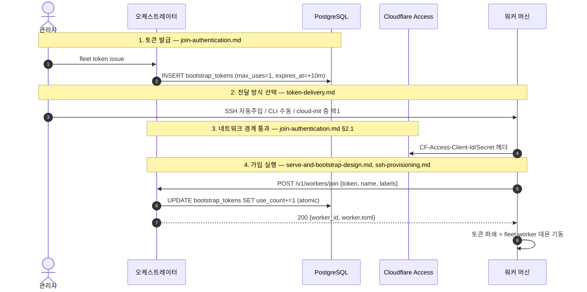

# 워커 부트스트랩 & 가입 인증 (Worker Bootstrap & Join Auth)

> 전체 문서 카탈로그는 [`../index.md`](../index.md).

새 워커가 오케스트레이터 클러스터에 안전하게 조인하는 전체 절차는 아래 4개 정본 문서가
서로 다른 관점에서 다룬다 — 순서대로 읽으면 전체 흐름이 이어진다.

| 문서 | 정본 범위 |
|---|---|
| [`bootstrap-release-v0.2.md`](./bootstrap-release-v0.2.md) | 🟢 정본 — 구현 현황 요약/색인 (코드 대비 검증됨, 상세는 아래 4개 문서로 위임) |
| [`join-authentication.md`](./join-authentication.md) | 인증 설계 — 상태 저장형 부트스트랩 토큰 + Cloudflare Access 이중 방어 |
| [`token-delivery.md`](./token-delivery.md) | 전달 방식 — SSH 자동주입 / CLI 수동 / cloud-init 비교, SSH 자동주입 권장 (⚠️ 토큰 주입 메커니즘 일부 정정, `bootstrap-release-v0.2.md §3.1` 참고) |
| [`ssh-provisioning.md`](./ssh-provisioning.md) | SSH 자동 프로비저닝 구현 명세 (시퀀스 + 셸 + Rust 의사코드) (⚠️ 토큰 주입 메커니즘 일부 정정, `bootstrap-release-v0.2.md §3.1` 참고) |
| [`serve-and-bootstrap-design.md`](./serve-and-bootstrap-design.md) | `fleet serve` 모듈 설계 + 부트스트랩/운영 수명주기 |
