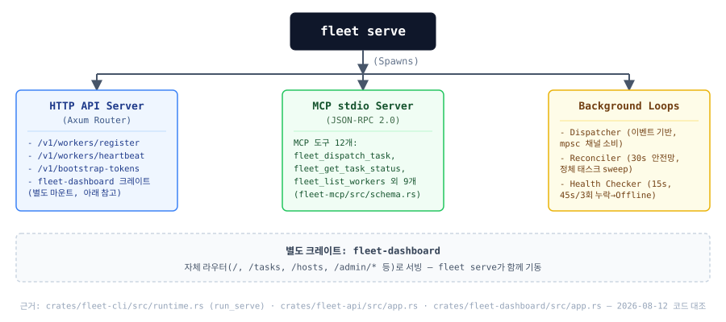

# 오케스트레이터 및 워커 설치/연동 가이드 — 구현 현황 요약 (Release v0.2)

> **문서 성격**: 이 문서는 `fleet`/`fleet-worker` 설치·조인·프로비저닝의 **실제 코드 구현 현황을 코드 대비 검증한 요약/색인 문서**입니다. 각 주제의 상세 설계는 아래 §0 표에 링크된 정본 문서를 참조하세요. 이 문서 단독으로 전체 스펙을 재서술하지 않습니다 — v0.1(2026-08-06)까지는 세부 설계가 문서마다 중복 서술되어 있었고, 실제 코드가 갱신되며 문서 간 불일치가 발생했습니다. v0.2는 그 중복을 없애고 "지금 코드가 실제로 무엇을 하는지"를 한곳에서 확인할 수 있게 하는 데 목적이 있습니다.
>
> 최종 코드 대조 검증일: 2026-08-12.

---

## 0. 문서 지도 (Documentation Map)

| 주제 | 정본 문서 | 구현 상태 (2026-08-12 기준) |
|---|---|---|
| 토큰 인증 (부트스트랩 토큰 + Cloudflare Access) | [`join-authentication.md`](./join-authentication.md) | 🟢 구현됨 |
| 토큰 전달 방식 3종 비교 | [`token-delivery.md`](./token-delivery.md) | 🟡 대체로 구현됨 — SSH 자동 주입의 세부 메커니즘 일부가 실제 코드와 다름 (§3.1 참고) |
| SSH 자동 프로비저닝 상세 명세 | [`ssh-provisioning.md`](./ssh-provisioning.md) | 🟡 대체로 구현됨 — 토큰 주입 메커니즘 서술이 실제 코드와 다름 (§3.1 참고, 문서 상단에 정정 배너 추가됨) |
| `fleet serve` 아키텍처 + 대시보드 설계 | [`serve-and-bootstrap-design.md`](./serve-and-bootstrap-design.md) | 🟢 대부분 구현됨 — 수치 일부 정정 필요 (§1 참고) |
| `.ssh/config` 자동 임포트 + 라벨 매핑 | 본 문서 §3.2 | 🔴 미구현 — 신규 설계 제안 |

---

## 1. `fleet serve` — 코드 대비 검증된 현황



> 이 다이어그램은 [`serve-and-bootstrap-design.md §1`](./serve-and-bootstrap-design.md)과 공유합니다 — 갱신 시 두 문서 모두 확인하세요.

이전 버전(v0.1) 대비 정정된 사실관계:

| 항목 | 이전 문서 서술 | 실제 코드 (파일 근거) |
|---|---|---|
| MCP 도구 개수 | 7개 | **8개** — `fleet_dispatch_task`, `fleet_get_task_status`, `fleet_list_workers`, `fleet_list_tasks`, `fleet_cancel_task`, `fleet_wait_for_task`, `fleet_stream_task_output`, `fleet_collect_results` (`crates/fleet-mcp/src/schema.rs`) |
| 태스크 디스패처 방식 | `fleet_tasks` 테이블을 1초 주기 폴링 | **이벤트 기반** (`mpsc` 채널 소비, `crates/fleet-scheduler/src/dispatcher.rs`). 테이블명도 `tasks`(`fleet_tasks` 아님). 별도로 정체된 태스크를 쓸어가는 **reconciler**가 **30초** 주기로 동작(`crates/fleet-scheduler/src/reconcile.rs`, 안전망 용도) |
| 헬스체커 주기/오프라인 판정 | 15초 간격, 45초(3회 누락) | **일치** — `crates/fleet-scheduler/src/health.rs`의 `HealthConfig::default` |
| 회로차단기 | Circuit Breaker 언급 | **일치, 실제 3상태(Closed/Open/HalfOpen) 구현** — `crates/fleet-scheduler/src/breaker.rs`, `workers.circuit_state` 컬럼에 영속화 |
| ACP over WebSocket | 태스크 위임 전송 방식 | **일치** — `crates/fleet-transport/src/acp_transport.rs`, 공식 `agent-client-protocol` SDK 기반 |
| `/dashboard` 경로 | HTTP API 라우터의 정적 자산 경로 | 실제로는 **별도 크레이트 `fleet-dashboard`**가 자체 라우터(`/`, `/tasks`, `/hosts`, `/admin/*` 등)로 서빙하며 `fleet serve`가 함께 기동 |

상세 모듈 설계(대시보드 RBAC, SSE 등)는 [`serve-and-bootstrap-design.md`](./serve-and-bootstrap-design.md)를 정본으로 참조하세요.

---

## 2. 워커 설치 및 수동 조인(Join) — 검증됨, 실제 코드와 일치

전체 시퀀스 다이어그램은 [`serve-and-bootstrap-design.md §3`](./serve-and-bootstrap-design.md)을 참조하세요. 여기서는 운영자가 그대로 복사해 실행할 수 있는 명령어만 정리합니다.

### 1) 설치

```bash
# install.sh 원라인 설치 (아키텍처 자동 판별: uname -s/-m → x86_64-unknown-linux-gnu 등)
curl -fsSL https://github.com/yarang/grok-fleet-orchestrator/releases/latest/download/install.sh | bash

# 소스 빌드 (install.sh --build 모드가 내부적으로 실행하는 것과 동일)
cargo build --release --features "acp mtls"
```

### 2) 토큰 발급 및 조인

```bash
# 오케스트레이터에서
fleet token issue --max-uses 1

# 워커 머신에서
sudo fleet-worker join \
  --orchestrator-url http://<오케스트레이터_IP>:<포트> \
  --token <발급받은_토큰> \
  --name <워커_이름> \
  --config-out /etc/fleet/worker.toml   # 기본값도 /etc/fleet/worker.toml
```

### 3) 서비스 등록

```bash
sudo systemctl daemon-reload
sudo systemctl enable --now fleet-worker.service
```

systemd 유닛 템플릿은 `crates/fleet-provisioner/src/templates.rs`(`FLEET_WORKER_UNIT`)에 실제로 정의되어 있으며 예시 유닛 파일이 `examples/fleet-worker.service`, `examples/fleet.service`로도 제공됩니다.

---

## 3. SSH 프로비저닝 자동화 — 구현됨 vs 신규 제안 (구분 필수)

### 3.1 실제 구현됨: `fleet provision --host / --inventory`

`fleet provision`은 이미 존재하는 명령이지만, v0.1 문서들이 서술한 것과 **CLI 인자·내부 메커니즘이 다릅니다.**

```bash
# 단일 호스트
fleet provision --host <worker-ip> --user ubuntu --ssh-key ~/.ssh/id_ed25519 \
  --labels arch=arm64,gpu=false --orchestrator-url https://fleet.agentthread.dev

# 인벤토리 파일 기반 (--host와 상호 배타)
fleet provision --inventory workers.yaml --orchestrator-url https://fleet.agentthread.dev
```

주요 플래그: `--host` / `--inventory <파일>`(상호 배타), `--user`, `--ssh-port`, `--ssh-key`, `--labels`, `--cf-token`, `--orchestrator-url`, `--fleet-worker-bin`, `--grok-secret`, `--bootstrap-token`, `--api-token` (`crates/fleet-cli/src/main.rs`).

**토큰 주입 메커니즘도 기존 문서 서술과 다릅니다.** `ssh-provisioning.md`/`token-delivery.md`가 서술하는 `/run/fleet-bootstrap.token`에 SFTP로 써넣고 `shred -u -n 3`로 파쇄하는 2단계 흐름은 **코드에 존재하지 않습니다.** 실제로는 `crates/fleet-provisioner/src/steps/install_fleet_worker.rs`가 `bootstrap_token`이 이미 내장된 완성된 `worker.toml`을 단일 파일 쓰기로 `/etc/fleet/worker.toml`에 직접 씁니다 — 별도 토큰 파일도, 별도 파쇄 단계도 없습니다. `russh`/`russh-keys` 기반 SSH 클라이언트(`crates/fleet-provisioner/src/ssh.rs`)는 실재하며, 호스트 키 검증 정책도 `accept-all`/`tofu`/`strict` 3단계로 실제 구현되어 있습니다.

> ⚠️ `ssh-provisioning.md`와 `token-delivery.md`는 이 사실을 반영해 별도로 패치했습니다(상단 정정 배너 추가). 두 문서를 전면 재작성하는 작업은 별도 이슈로 트래킹하는 것을 권장합니다 — 본 문서에서 다루는 범위를 넘어섭니다.

### 3.2 신규 설계 제안 (미구현): `.ssh/config` 자동 임포트

아래는 **아직 코드로 구현되지 않은 제안**입니다. `--import-ssh-config`, `.ssh/config` 파서, `labels.yaml` 병합 로직 모두 저장소에 존재하지 않습니다(전수 검색 결과 0건). 구현 시 다음을 반영해 설계하세요.

#### 3.2.1 스키마 — 신규 테이블 대신 기존 `hosts` 테이블 확장을 권장

`inventory_hosts`라는 별도 테이블을 새로 만들면 이미 존재하는 `hosts` 테이블(`crates/fleet-store/migrations/007_hosts.sql`)과 목적이 상당 부분 겹칩니다. `hosts`는 이미 `hostname`(UNIQUE), `ssh_host`/`ssh_port`/`ssh_user`, `status`(`provisioned|online|offline|failed`), `worker_id` FK, `provisioned_at`/`created_at`/`updated_at`(트리거로 자동 갱신)을 갖고 있습니다. 다만 스케줄러 라벨은 `hosts`가 아니라 `workers.labels`(JSONB, GIN 인덱스)에만 존재해 — `.ssh/config` 임포트 단계(아직 워커로 등록되기 전)에서는 라벨을 붙일 곳이 없다는 문서의 지적(v0.1 §4)은 **유효한 문제**입니다. 새 테이블 대신 컬럼 확장으로 해결하는 것을 제안합니다:

```sql
-- 014_host_inventory.sql (제안 — 파일명/번호는 구현 시 확정)
ALTER TABLE hosts ADD COLUMN host_alias TEXT UNIQUE;                    -- .ssh/config의 Host 별칭
ALTER TABLE hosts ADD COLUMN identity_file TEXT;                        -- ssh_keys.name 참조 (금고 키 이름 — 원문 키는 저장 안 함, §3.2.2)
ALTER TABLE hosts ADD COLUMN labels JSONB NOT NULL DEFAULT '{}'::jsonb; -- workers.labels와 동일 패턴
CREATE INDEX idx_hosts_labels_gin ON hosts USING GIN (labels jsonb_path_ops); -- 002_indexes.sql의 workers 인덱스와 동일 패턴
```

기존 컨벤션(`UUID` PK, `TEXT`, `TIMESTAMPTZ`, `'{}'::jsonb` 명시 캐스팅, `updated_at` 트리거)을 그대로 따릅니다.

#### 3.2.2 보안 — IdentityFile 자동 수집: 기존 SSH 키 금고(Vault) 재사용

> **정정 (2026-08-12, 2차)**: 이전 개정에서는 개인키 원문 자동 수집을 기본값으로 채택하지 말 것을 권고했습니다. 이후 확인 결과 **이미 구현되어 있는 중앙 SSH 키 금고**(`ssh_keys` 테이블, `crates/fleet-dashboard/src/provisioning.rs`)가 "중앙 관리 + 사용자는 키 소지 없이 권한으로 접근"이라는 목표를 정확히 만족하도록 이미 설계·구현되어 있음을 확인했습니다. 새로운 위험한 메커니즘을 만들 필요 없이 **이 금고를 그대로 재사용**하는 것을 권장 설계로 채택합니다.

##### 이미 구현됨 — SSH 키 금고

- 개인키는 `fleet_credentials::MasterKey`(AES-256-GCM — `worker_credentials` 테이블과 동일한 암호화 프리미티브)로 암호화되어 `ssh_keys.encrypted_blob`에 저장됩니다. 평문은 DB에 남지 않습니다.
- 프로비저닝은 키 원문이 아니라 **이름으로 참조**합니다 — `POST /api/hosts/provision`의 `ssh_key_name` 필드가 금고에서 조회 후 서버 메모리에서만 복호화합니다(`provisioning.rs`). 사용자는 키 파일을 소지·전송할 필요가 없습니다.
- 접근 제어는 **22종으로 세분화된 `PermissionKind`** 기반 RBAC입니다(`crates/fleet-core/src/auth.rs`) — 단순 Admin/User 이분법이 아닙니다. 기본 제공 역할은 `Admin`/`Operator`/`Viewer` 3종이며, 키 생성·삭제·프로비저닝 실행은 모두 `HostProvision`(`host:provision`) 권한 하나로 게이트됩니다. 기본값으로는 `Admin`만 이 권한을 갖지만, 역할은 확장 가능(`RoleCreate`)하므로 "프로비저닝 전담" 같은 커스텀 역할을 만들어 이 권한만 부여할 수 있습니다 — **개인 SSH 키가 없는 사용자도 권한만 있으면 즉시 호스트를 프로비저닝할 수 있습니다.**
- ⚠️ `/admin/ssh-keys` 경로명은 참고용일 뿐입니다. 실제 라우터는 인증 세션만 요구하고 접근 제어는 전부 핸들러 내부의 `require_permission(HostProvision)` 호출로 이뤄집니다 — URL을 신뢰 경계로 착각하지 마세요.
- (참고) [`serve-and-bootstrap-design.md §2.1`](./serve-and-bootstrap-design.md)의 "Admin/User 2역할 RBAC" 서술은 이 세분화된 권한 체계 도입 이전 버전으로, 갱신이 필요합니다.

##### `.ssh/config` 자동 임포트와의 통합 (신규 제안)

`.ssh/config` 임포트(§3.2) 시점에 `IdentityFile` 경로가 발견되면 다음 순서로 "자동 수집"을 구현합니다:

1. 임포터(관리자 로컬 머신에서 실행되는 CLI 컨텍스트)가 해당 경로의 키 파일을 읽습니다.
2. 읽은 즉시 — DB에 평문으로 남기지 않고 — 기존 `create_ssh_key` 저장 경로(`MasterKey::encrypt`)를 그대로 호출해 금고에 등록합니다. 이름은 기본적으로 `host_alias`를 사용합니다.
3. `hosts.identity_file` 컬럼에는 로컬 파일 경로 대신 **금고 키 이름**을 저장합니다(예: `identity_file = 'my-worker-alias'`가 곧 `ssh_keys.name`을 가리킴 — §3.2.1 DDL의 컬럼 주석도 이에 맞춰 갱신).

이 방식은 "자동"(관리자가 매번 웹에서 붙여넣지 않아도 됨)과 "중앙 관리"(평문 키가 orchestrator DB 밖으로 나가지 않고 프로비저닝은 이름 참조로만 이뤄짐)를 동시에 만족합니다.

##### 남은 격차 — 구현 전 처리 필요

- **감사 로그 부재**: 키 생성·삭제·사용이 `audit_log` 테이블에 전혀 기록되지 않습니다. 현재는 `tracing::info!` 로그(조회 불가)와 `host_events`의 자유 텍스트 메시지(`"Provisioning by {username}..."`, 구조화된 actor 컬럼 없음)뿐입니다. 인증/사용자 관리 액션에 이미 쓰이고 있는 `record_audit_event()` 경로를 `create_ssh_key_api`/`delete_ssh_key_api`/`provision_host_api`에도 연결해야 "권한에 따라 제어"가 사후 추적 가능한 통제로 완성됩니다.
- **키 로테이션 API 부재**: 현재 생성/삭제만 있고 갱신(rotate) 엔드포인트가 없습니다. 로테이션은 사실상 "새 이름으로 생성 → 참조하는 모든 `ssh_key_name` 갱신 → 구키 삭제"로만 가능합니다.
- **MCP 미노출**: "사용자가 MCP로 orchestrator에 접근"하는 경로가 아직 없습니다 — 현재 8개 MCP 도구(`crates/fleet-mcp/src/schema.rs`) 중 프로비저닝/키 관련 도구가 전무하며, 이 기능은 대시보드 HTTP API 전용입니다. 신규 MCP 도구(예: `fleet_provision_host`)를 추가하려면, stdio 서브프로세스 채널 기반의 현재 MCP 인증 모델을 위 `PermissionKind` 권한 체계와 어떻게 연결할지부터 설계해야 합니다 — 이 부분은 별도 SPEC이 필요합니다.
- **CLI 경로가 금고를 우회함**: `fleet provision --host/--inventory --ssh-key <로컬경로>`는 금고를 거치지 않고 운영자 로컬 파일을 직접 읽습니다(`crates/fleet-cli/src/runtime.rs`). 중앙 관리가 목표라면 CLI에도 `--ssh-key-name <금고이름>` 옵션을 추가하거나, 로컬 파일 경로 사용을 에어갭/최초 부트스트랩 등 예외 상황으로만 한정하는 정책 결정이 필요합니다.
- **임시 키 파일 정리가 단순 삭제**: 프로비저닝 중 복호화된 키를 `/tmp/.fleet-ssh-key-{uuid}`에 0600 권한으로 잠깐 쓰고 완료 후 `remove_file`로 지우지만, 덮어쓰기 없는 일반 삭제입니다. 강화하려면 삭제 전 덮어쓰기(`zeroize` 등)를 추가하세요.
- **`fingerprint`는 표시용**: `ssh_keys.fingerprint`는 실제 SSH 공개키 fingerprint가 아니라 개인키 텍스트의 SHA-256 앞부분입니다 — 키 신원 검증 용도로 쓰지 마세요.
- `known_hosts` TOFU 검증은 최초 연결 시 스푸핑을 탐지할 수 없는 근본 한계가 있습니다. 최초 등록 시 호스트 지문을 관리자가 대시보드에서 육안 확인하는 단계를 넣는 것을 권장합니다.
- 프로비저닝 흐름도 [`join-authentication.md`](./join-authentication.md)가 정의한 **Cloudflare Access 1단계 방어**를 통과해야 합니다 — 워커가 오케스트레이터의 `/v1/workers/join`을 호출하는 구간은 동일한 네트워크 경계 보안을 적용합니다.

#### 3.2.3 실패 경로

`hosts.status`에 이미 `failed` 값이 정의되어 있으므로, 프로비저닝 실패 시 `host_events`(`007_hosts.sql`)에 `provision_fail` 이벤트를 기록하고 `status`를 `failed`로 전환하는 경로를 시퀀스에 포함해야 합니다. 재시도 정책(동일 호스트 재프로비저닝 허용 여부), SSH 세션/명령 타임아웃 값도 구현 전에 확정이 필요합니다.

### 3.3 라벨 매핑 (`labels.yaml`) — 최소 스키마 예시

```yaml
# labels.yaml
hosts:
  my-worker-alias:
    arch: arm64
    gpu: "false"
  gpu-box-1:
    arch: x86_64
    gpu: "true"
# 예: .ssh/config에는 있지만 여기 정의되지 않은 `db-01`(HostName db-01.seoul.example.com)은
# labels.yaml 매칭 실패 → 아래 폴백 규칙에 따라 {"host": "db-01", "domain": "seoul.example.com"}로 자동 등록됨
```

- `.ssh/config`의 `Host` 별칭과 `labels.yaml`의 키가 매칭되지 않는 호스트는 **임포트를 실패시키지 않고, 빈 `{}` 대신 호스트 자체 정보에서 유도(derive)한 폴백 라벨을 자동 부여**하는 것을 기본 동작으로 제안합니다:
  1. `host: <host_alias>` — 항상 부여합니다. `labels.yaml`에 정의가 없어도 스케줄러가 `required_labels`로 특정 호스트 하나를 직접 지목할 수 있는 최소 식별자입니다.
  2. `HostName`(`hosts.hostname` 컬럼)이 FQDN 형태(`.` 포함)라면, 첫 세그먼트를 제외한 나머지를 `domain` 라벨로 조합해 함께 부여합니다. 예: `HostName gpu01.seoul.example.com` → `host: gpu01`, `domain: seoul.example.com`. `HostName`이 순수 IP거나 `.`이 없는 짧은 이름이면 `domain`은 생략합니다.
  - `labels.yaml`에 명시적으로 정의된 라벨은 이 폴백 라벨보다 항상 우선합니다(explicit > derived) — 동일 키가 있으면 명시값이 폴백값을 덮어씁니다.
  - 매칭 실패는 예외 상황이 아니라 정상 폴백 경로이므로 경고(warn)가 아닌 정보(info) 로그로 기록해 추적성만 남깁니다.
  - `host`/`domain` 라벨 키는 `crates/fleet-scheduler/src/selector.rs`의 `required_labels`(키 존재 여부 매칭) 방식과 그대로 호환되며, 기존 예약 키인 `model`(값 일치 매칭)과 충돌하지 않습니다.
- 대시보드 인라인 라벨 편집 UI는 [`docs/ui-dashboard/ui-design.md`](../ui-dashboard/ui-design.md)의 "SSH Config 자동 임포트 UI 흐름" 절을 정본으로 참조하세요.

---

## 변경 이력

- **2026-08-12**: v0.2 최초 작성분을 코드 대비 검증 후 요약/색인 문서로 축소. MCP 도구 개수·디스패처 동작 방식 정정, SSH 프로비저닝을 "구현됨(§3.1)"과 "신규 제안(§3.2)"으로 명확히 분리, `inventory_hosts` 신규 테이블 제안을 기존 `hosts` 테이블 확장안으로 변경, IdentityFile 처리 기본값(수동 허용)을 명시, 실패 경로 보완. `ssh-provisioning.md`/`token-delivery.md`에 정정 배너 추가(연동 패치). §3.3 `labels.yaml` 매칭 실패 시 동작을 "빈 라벨 등록"에서 "`host`(+FQDN이면 `domain`) 폴백 라벨 자동 유도"로 변경.
- **2026-08-12 (2차)**: §3.2.2를 재작성 — IdentityFile "자동 수집 모드"를 기본값으로 전환하되, 새 메커니즘을 만드는 대신 이미 구현되어 있는 SSH 키 금고(`ssh_keys` 테이블 + `fleet-dashboard`, 22종 `PermissionKind` 기반 RBAC)를 재사용하는 설계로 확정. 감사 로그 부재·키 로테이션 API 부재·MCP 미노출·CLI의 금고 우회 등 실제 남은 격차를 명시.
