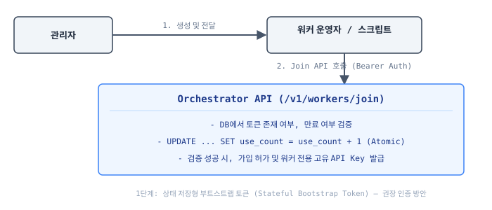
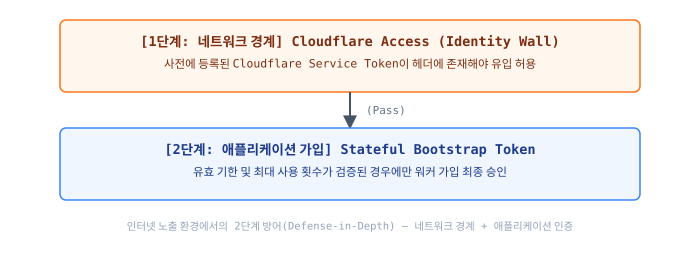

# 워커 최초 가입(Join) 시 API 인증 방안 설계서

이 설계서는 신뢰할 수 없는 환경이나 외부 네트워크에 존재하는 워커 노드가 최초로 오케스트레이터 API 서버에 접근하여 등록(`/v1/workers/join`)을 시도할 때, **보안성과 편의성을 동시에 충족하기 위한 다중 인증 방안(Multi-Layered Authentication)**을 제시합니다.

---

## 1. 권장 인증 방안: 상태 저장형 부트스트랩 토큰 (Stateful Bootstrap Token)

상업적 운영 시 가장 안정적이고 통제하기 쉬운 **상태 저장형 OTP형 토큰 방식**을 메인 인증 방안으로 채택합니다.

### 1.1 인증 시퀀스 상세 정보
1. **토큰의 구조**: 
   * 높은 엔트로피를 가지는 난수 문자열 형태를 사용합니다 (예: `fleet_tok_a8f9d2e1c3b5478a9012`).
   * 접두사 `fleet_tok_`를 붙여 정적 분석 도구(GitGuardian 등)가 코드 내 유출을 쉽게 탐지할 수 있도록 유도합니다.
2. **속성 설정**:
   * **`max_uses` (최대 사용 횟수)**: 기본값 `1` (일회성 토큰). 단일 서버 추가 시 1회 사용 직후 즉시 소멸되므로 유출 시의 리스크를 원천적으로 통제합니다.
   * **`expires_at` (만료 기한)**: 기본값 생성 후 `1시간` 또는 `24시간`. 가입 작업이 끝난 후에는 토큰이 탈취되더라도 기한 만료로 무효화됩니다.

---

## 2. 보안 심화 방안: 2단계 레이어 방어 (Defense-in-Depth)

인터넷에 노출된 퍼블릭 클라우드 환경에서는 부트스트랩 토큰만으로는 무차별 대입 공격(Brute-force)이나 API 서버 취약점 공격에 노출될 수 있으므로, **네트워크 경계 및 게이트웨이 보안**을 묶은 2단계 방어 체계를 가동합니다.

### 2.1 1단계: Cloudflare Service Token (네트워크 장벽)
* **원리**: 오케스트레이터 API 전면에 Cloudflare Access 방화벽을 배치합니다.
* **인증**: 워커 가입 스크립트는 Cloudflare에서 발급한 **Service Token ID 및 Client Secret**을 요청 헤더(`CF-Access-Client-Id`, `CF-Access-Client-Secret`)에 실어 전송해야만 방화벽을 통과할 수 있습니다.
* **효과**: 토큰 검증 이전에 일반적인 인터넷 대중으로부터 API 엔드포인트 자체를 완전히 숨길 수 있습니다.

### 2.2 2단계: 가입 승인 및 개별 자격증명(Credentials) 발급
* **원리**: 1단계를 거쳐 들어온 요청에 대해 오케스트레이터가 부트스트랩 토큰 유효성을 판별합니다.
* **인증서 발급**: 가입이 승인되는 즉시, 오케스트레이터는 해당 워커 전용 고유 API Key(또는 mTLS를 위한 임시 클라이언트 인증서)를 발급하여 응답에 포함시킵니다.
* **영구 세션 전환**: 이후의 주기적 하트비트 및 작업 폴링 통신은 일회용 부트스트랩 토큰이 아닌, **가입 성공 시 발급받은 워커 개별 고유 API Key**를 통해서만 인증을 수행합니다.

---

## 3. 타 인증 대안과의 비교 분석

| 인증 방식 | 구현 난이도 | 보안 수준 | 상업적 적합성 | 비고 |
| :--- | :--- | :--- | :--- | :--- |
| **A. 부트스트랩 토큰 (권장)** | 🟢 쉬움 | 🟢 높음 (OTP 속성) | 🟢 최상 | 일회용 발급으로 공격 표면이 지극히 좁음. |
| **B. 서명된 JWT 토큰** | 🟡 보통 | 🟡 보통 | 🟡 보통 | 분산 검증은 빠르나 일회성 무효화 처리를 위해 결국 DB 조회가 필요함. |
| **C. SSH Challenge** | 🔴 어려움 | 🟢 매우 높음 | 🟡 보통 | 수동 셀프 가입 시 클라이언트 측 키 관리가 복잡해짐. |
