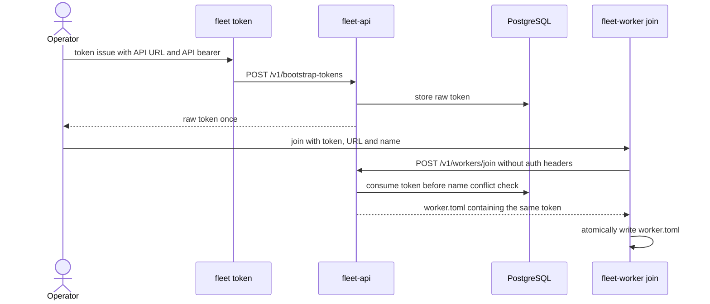

# Worker 수동 가입 Runbook

이 문서는 현재 구현된 `fleet-worker join` 절차를 설명한다. 프로덕션 승인 기준과 목표 credential
계약은 [Worker enrollment](../contracts/worker-enrollment.md)이 우선한다.

## 현재 흐름



현재 join 요청에는 API bearer와 Cloudflare assertion이 없다. API token 또는 Cloudflare 보호가
활성화된 서버에서는 handler에 도달하기 전에 거절된다. 보호를 끄고 외부에 노출하는 방식으로
우회하지 않는다.

## 사전 조건

1. `fleet`와 `fleet-worker`의 version이 호환되는지 확인한다.
2. Orchestrator의 API URL과 관리 API bearer를 준비한다.
3. 현재 인증 조합에서 join이 허용되는지 [인증 행렬](../contracts/worker-enrollment.md#현재-구현)을
   확인한다.
4. `/etc/fleet/worker.toml`에 원문 token과 endpoint secret이 남는 현재 위험을 승인하지 않았다면
   중단한다.

## 실행

Orchestrator 관리 환경에서 `FLEET_API_URL`과 `FLEET_API_TOKEN`을 권한이 제한된 실행 환경에
주입한 뒤 token을 발급한다. 원문은 표준 출력에 한 번 표시되므로 terminal 기록 정책을 먼저
확인한다.

```bash
fleet token issue \
  --max-uses 1 \
  --expires-in-secs 600
```

Worker에서 `FLEET_ORCHESTRATOR_URL`, `FLEET_BOOTSTRAP_TOKEN`, `FLEET_WORKER_NAME`을 권한이
제한된 일회성 실행 환경으로 주입한 뒤 가입한다. `--token` 인자도 지원하지만 process list와 shell
history에 노출되므로 사용하지 않는다.

```bash
sudo fleet-worker join \
  --config-out /etc/fleet/worker.toml
```

## 검증

1. 명령이 성공하고 `/etc/fleet/worker.toml`이 생성됐는지 확인한다.
2. 설정 파일 소유권과 mode가 의도한 서비스 계정의 `0600`인지 확인한다. join 자체는 기존 파일
   mode를 강제하지 않으므로 별도 검증이 필요하다.
3. Worker daemon 시작 전에 설정에 원문 bootstrap token과 `[grok].secret`이 들어 있음을 확인하고
   접근 범위를 제한한다.
4. daemon 시작 뒤 register와 heartbeat 성공 여부를 서버 log와 Worker 상태에서 확인한다.

## 실패와 중단

- `401` 또는 edge 인증 거절이면 token을 다시 발급해 반복하지 말고 인증 경계 설계를 확인한다.
- Worker name 충돌은 현재 token을 이미 소진할 수 있다. 이름을 확인한 뒤 새 token을 발급한다.
- join 응답 오류 문자열에 민감한 token 정보가 포함될 가능성이 있으므로 원문 오류를 공유 log에
  복사하지 않는다.
- 실패한 설정 파일과 shell history의 token을 정리하되, 실행 증거가 필요한 보안 사고라면 먼저
  사고 대응 절차에 따라 보존한다.

## 관련 절차

- [Worker 프로비저닝](../deployment/worker-provisioning.md): SSH로 바이너리와 설정을 배포하는 별도 경로
- [구성과 비밀 관리](../deployment/configuration.md)
- [Control Plane 보안 모델](../security/control-plane-security-model.md)
