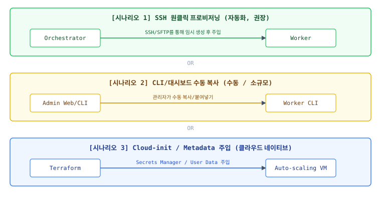

# Bootstrap token 전달 방식 제안

> **Proposed:** 이 문서는 전달 채널의 비교·목표를 보존한다. 현재 구현은 token을 포함한
> `worker.toml`을 직접 기록하며, SFTP token-file·`--token-file`·shred 절차는 구현되지 않았다.
> 현재·목표 가입 계약은 [`contracts/worker-enrollment.md`](../contracts/worker-enrollment.md)를 우선한다.

이 설계서는 워커 노드가 오케스트레이터에 가입할 때 사용하는 **최초 부트스트랩 토큰(Bootstrap Token)을 워커 서버에 유출 없이 안전하고 편리하게 주입(Provisioning / Delivery)하기 위한 채널 및 시나리오**를 정의합니다.

---

## 1. 초기 토큰 주입의 3대 시나리오

운영 환경과 자동화 수준에 따라 최적화된 **3가지 주입 방식**을 제공합니다.

---

## 2. 시나리오별 상세 구현 방안

### 2.1 [권장] SSH 자동화 주입 (Secure SSH Provisioning)
오케스트레이터 서버 내의 자동 프로비저너(`fleet provision`) 모듈이 동작할 때 **토큰을 백엔드에서 자동 생성하고 SSH를 통해 은밀하게 워커에 주입**하는 방식입니다.
* **작동 프로세스**:
  1. 관리자가 오케스트레이터 서버에서 `fleet provision --host <worker-ip> --ssh-key <key>` 실행.
  2. 오케스트레이터가 DB에 유효기간 10분짜리 1회용(max_uses=1) 토큰을 자동 생성.
  3. SFTP 프로토콜을 사용해 워커 노드의 `/run/fleet-bootstrap.token` (RAM 디스크 경로 권장, 0600 권한)에 토큰 값을 쓰기 처리.
  4. SSH 채널로 `fleet-worker join --token-file /run/fleet-bootstrap.token ...` 실행.
  5. 가입 성공 즉시 워커는 토큰 파일을 물리적으로 파쇄(shred) 및 제거.
* **장점**: 관리자가 토큰 문자열을 직접 보거나 타이핑할 필요가 전혀 없으므로 휴먼 에러 및 스크린샷 유출을 방지합니다.

### 2.2 CLI/대시보드 수동 주입 (Manual Out-of-band Delivery)
자동화된 SSH 접근 권한이 막혀 있는 폐쇄망이나 1~2대의 소규모 서버를 개별 세팅할 때 사용하는 수동 폴백(Fallback) 방식입니다.
* **작동 프로세스**:
  1. 어드민이 웹 대시보드(부트스트랩 토큰 관리 메뉴)에서 `Generate Token` 클릭 또는 CLI에서 `fleet token issue` 실행.
  2. 화면에 표시되는 **1회용 토큰 문자열** 복사 (또는 1회용 QR 코드 제공).
  3. 대상 워커 서버의 SSH 터미널에 직접 접속하여 `fleet-worker join --token <복사한토큰>` 실행.
* **장점**: 인프라 조건(네트워크, SSH 키 관계 등)에 구애받지 않고 언제나 실행 가능합니다.
* **단점**: 복사/붙여넣기 과정에서 중간 클립보드 탈취 위험이 존재합니다.

### 2.3 Cloud-init / 사용자 데이터 주입 (Cloud-Native Metadata)
AWS, OCI 등 클라우드 인프라에서 자동 확장(Auto-scaling) 그룹을 통해 워커 노드가 자동으로 띄워질 때 사용하는 무인(Unattended) 가입 방식입니다.
* **작동 프로세스**:
  1. 인프라 배포 도구(Terraform 등)가 오케스트레이터 API를 호출하여 토큰을 획득하거나, 사전에 발급된 다회용 토큰(max_uses=100)을 사용합니다.
  2. VM 인스턴스 생성 시 사용되는 **User Data(Cloud-init 스크립트)**에 환경변수 또는 파일 형태로 토큰을 삽입합니다.
  3. VM 부팅 시 내장된 시스템 데몬 초기화 스크립트가 실행되며 자동으로 `fleet-worker join` API를 호출하고 자가 기동합니다.
* **장점**: 대규모 인프라 확장 시 사람의 수동 개입이 전혀 필요하지 않습니다.

---

## 3. 주입 방식별 보안 및 편의성 매트릭스

| 제공 방식 | 보안성 | 사용자 편의성 | 자동화 적합성 | 주요 타겟 환경 |
| :--- | :--- | :--- | :--- | :--- |
| **SSH 자동 주입** | 🟢 최상 (메모리상 소멸) | 🟢 최상 (원클릭) | 🟢 높음 | 온프레미스 / 사설망 인프라 |
| **CLI 수동 복사** | 🟡 보통 (클립보드 노출) | 🔴 낮음 (복사 필요) | 🔴 불가 | 최초 구축 / 디버깅 단계 |
| **Cloud-init 주입**| 🟡 보통 (IaC 코드 노출) | 🟢 최상 (무인 자동화) | 🟢 최상 | 퍼블릭 클라우드 / ASG |

---

## 4. 최종 추천 설계
상업용 서비스 배포를 위해서는 **"SSH 자동 주입(fleet provision)"** 모듈을 시스템 기본 구성(Defualt)으로 채택하여 유출 경로를 원천 차단하고, SSH 통신이 불가능한 예외 인프라를 위해 **"웹 대시보드 1회용 일시 토큰 복사"**를 폴백용 관리 도구로 노출하는 하이브리드 전략을 제시합니다.
